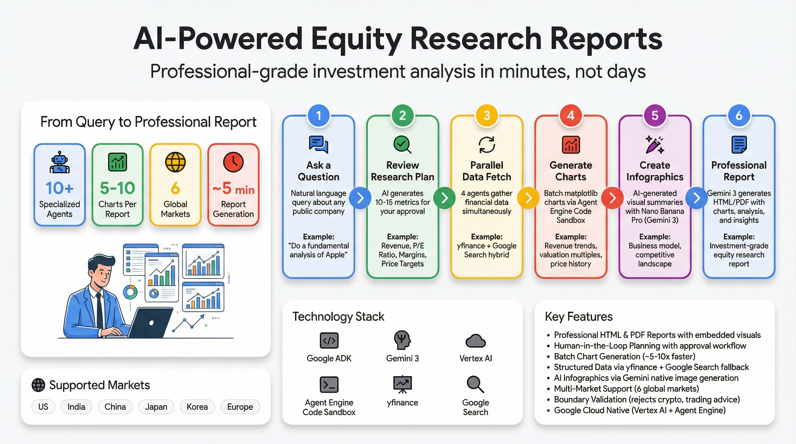

# Build with ADK

**Learn to build production-ready AI agents with Google's Agent Development Kit**

A collection of real-world multi-agent examples built with [Google Agent Development Kit (ADK)](https://google.github.io/adk-docs/). Each agent demonstrates different ADK patterns and capabilities - from video generation to code execution.

---

## Featured Agents

<table>
  <tr>
    <td width="33%" align="center">
      <a href="./ad-campaign-agent/">
        
      </a>
      <br>
      <a href="#ad-campaign-agent"><strong>Ad Campaign Agent</strong></a>
    </td>
    <td width="33%" align="center">
      <a href="./retail-ai-location-strategy/">
        
      </a>
      <br>
      <a href="#retail-ai-location-strategy"><strong>Retail AI Location Strategy</strong></a>
    </td>
    <td width="33%" align="center">
      <a href="./adk-equity-deep-research/">
        
      </a>
      <br>
      <a href="#equity-research-agent"><strong>Equity Research Agent</strong></a>
    </td>
  </tr>
</table>

### [Ad Campaign Agent](./ad-campaign-agent/)

Multi-agent platform for retail video advertising.

- AI video generation with Gemini + Veo 3.1
- Human-in-the-loop review workflow
- In-store analytics with AI-generated charts

```bash
cd ad-campaign-agent && make install && make dev
```

### [Retail AI Location Strategy](./retail-ai-location-strategy/)

Multi-agent pipeline for retail site selection.

- Live market research with Google Search
- Competitor mapping with Google Maps API
- Executive reports, infographics, and audio summaries

```bash
cd retail-ai-location-strategy && make install && make dev
```

### [Equity Research Agent](./adk-equity-deep-research/)

Multi-agent pipeline for professional equity research reports.

- Human-in-the-loop planning with user approval
- Batch chart generation via Agent Engine Sandbox
- Multi-market support (US, India, Europe, Asia)

```bash
cd adk-equity-deep-research && make setup && make dev
```

---

## Why This Repository?

Building AI agents that work in production requires more than prompt engineering. These examples demonstrate:

- **Multi-agent orchestration** - Hierarchical and sequential pipelines
- **Tool integration** - Google Maps, Search, GCS, and custom APIs
- **Structured outputs** - Pydantic schemas for type-safe responses
- **Production deployment** - Cloud Run and Vertex AI Agent Engine

---

## Getting Started

### Prerequisites

- **Python 3.10+**
- **[Google Cloud SDK](https://cloud.google.com/sdk/docs/install)** or [AI Studio API Key](https://aistudio.google.com/app/apikey)
- **[ADK CLI](https://google.github.io/adk-docs/get-started/installation/)** (`pip install google-adk`)

### Quick Start

```bash
git clone https://github.com/lavinigam-gcp/build-with-adk.git
cd build-with-adk

# Choose an agent
cd ad-campaign-agent          # Video advertising
cd retail-ai-location-strategy # Site selection
cd adk-equity-deep-research   # Equity research

# Setup and run
cp .env.example app/.env  # Edit with your API keys
make install && make dev

# Open http://localhost:8501
```

---

## Resources

- **[ADK Documentation](https://google.github.io/adk-docs/)** - Official ADK docs
- **[ADK Samples](https://github.com/google/adk-samples)** - Google's official sample agents
- **[Agent Starter Pack](https://goo.gle/agent-starter-pack)** - Production deployment templates

---

## Author

[Lavi Nigam](https://github.com/lavinigam-gcp)

### Collaborators

- [Deepak Moonat](https://github.com/dmoonat)

---

## License

Apache 2.0 - See individual agent folders for specific licenses.
