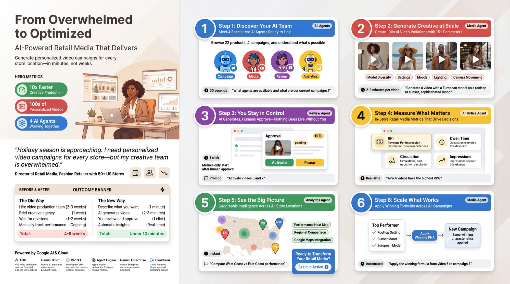
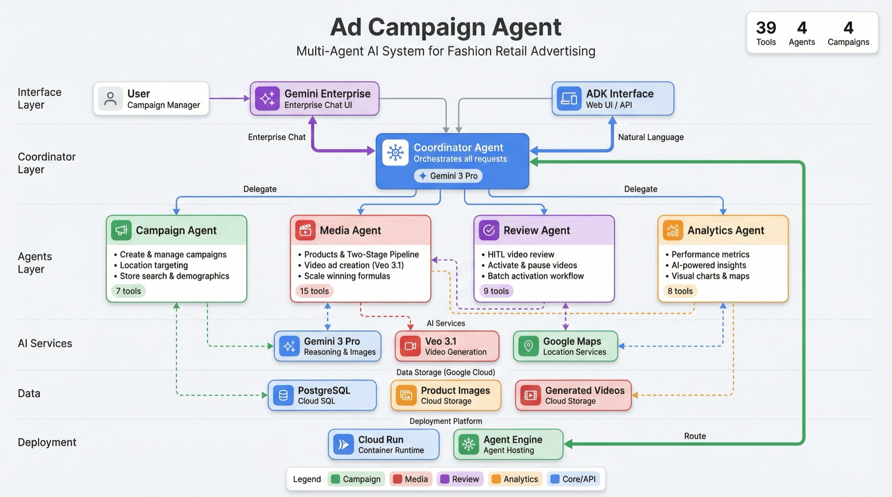
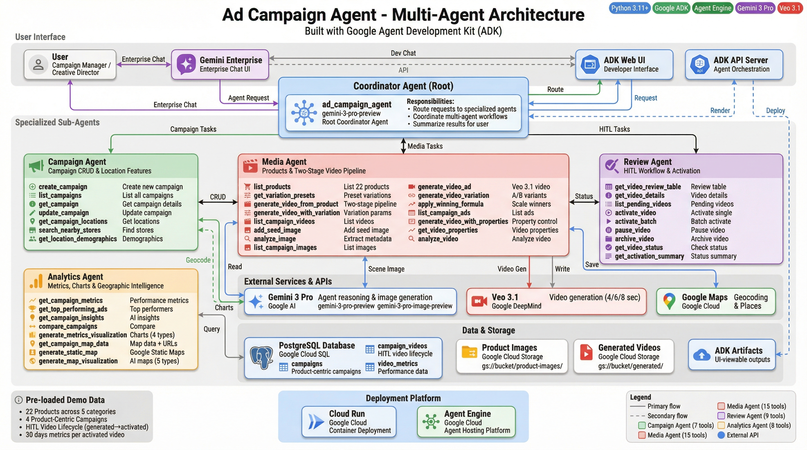

# Ad Campaign Agent with Google ADK

A multi-agent AI platform for retail video advertising, built with [Google Agent Development Kit (ADK)](https://google.github.io/adk-docs/) and Gemini.

<table>
  <thead>
    <tr>
      <th colspan="2">Key Features</th>
    </tr>
  </thead>
  <tbody>
    <tr>
      <td>🎬</td>
      <td><strong>AI Video Generation:</strong> Two-stage pipeline using Gemini for scene creation and Veo 3.1 for 8-second cinematic video animation.</td>
    </tr>
    <tr>
      <td>🤖</td>
      <td><strong>Multi-Agent Architecture:</strong> 4 specialized agents (Campaign, Media, Review, Analytics) coordinated by a root agent with 39 tools total.</td>
    </tr>
    <tr>
      <td>👥</td>
      <td><strong>Human-in-the-Loop:</strong> Review workflow where AI generates, humans approve. Nothing goes live without explicit activation.</td>
    </tr>
    <tr>
      <td>📊</td>
      <td><strong>In-Store Analytics:</strong> Retail-specific metrics (impressions, dwell time, RPI) with AI-generated charts and visualizations.</td>
    </tr>
    <tr>
      <td>🗺️</td>
      <td><strong>Geographic Intelligence:</strong> Google Maps integration for store-level performance analysis and location-based insights.</td>
    </tr>
    <tr>
      <td>🎨</td>
      <td><strong>Creative Variations:</strong> 15+ parameters for video customization (model ethnicity, setting, mood, lighting, camera movement).</td>
    </tr>
    <tr>
      <td>🏗️</td>
      <td><strong>Production-Ready:</strong> Deploy to <a href="https://cloud.google.com/run">Cloud Run</a> or <a href="https://cloud.google.com/vertex-ai/generative-ai/docs/agent-engine/overview">Vertex AI Agent Engine</a> via <a href="https://goo.gle/agent-starter-pack">Agent Starter Pack</a>.</td>
    </tr>
    <tr>
      <td>📦</td>
      <td><strong>Pre-loaded Demo:</strong> 22 fashion products, 4 campaigns across US locations, ready to generate and analyze.</td>
    </tr>
  </tbody>
</table>

<p align="center">
  
</p>

## What It Does

Given a product and store location, this platform automatically:

- Creates product-centric campaigns tied to specific store locations
- Generates scene images with AI models wearing the product
- Animates scenes into 8-second cinematic videos using Veo 3.1
- Manages human review workflow (approve, pause, archive)
- Tracks in-store retail metrics with AI-generated charts
- Scales winning video formulas across campaigns

---

## Getting Started: From Zero to Running Agent in 5 Minutes

**Prerequisites:**
- **[Python 3.11+](https://www.python.org/downloads/)**
- **[Google Cloud SDK](https://cloud.google.com/sdk/docs/install)** (for Vertex AI)
- **[ADK CLI](https://google.github.io/adk-docs/get-started/installation/)** (`pip install google-adk`)
- **[GCS Bucket](https://console.cloud.google.com/storage)** for storing product images and generated videos

You have two options to get started:

*   A. **[Google Cloud Vertex AI (Recommended)](#a-google-cloud-vertex-ai-recommended)**: Production-ready with Veo 3.1 video generation.
*   B. **[Google AI Studio](#b-google-ai-studio)**: Quick start for testing (limited video features).

---

### A. Google Cloud Vertex AI (Recommended)

Vertex AI is required for Veo 3.1 video generation. You'll need a **Google Cloud Project** with Vertex AI API enabled.

#### Step 1: Clone Repository
```bash
git clone https://github.com/lavinigam-gcp/build-with-adk.git
cd build-with-adk/ad-campaign-agent
```

#### Step 2: Set Environment Variables
Create a `.env` file in the `app` folder (see `.env.example` for reference):

```bash
echo "GOOGLE_GENAI_USE_VERTEXAI=TRUE" >> app/.env
echo "GOOGLE_CLOUD_PROJECT=YOUR_PROJECT_ID" >> app/.env
echo "GOOGLE_CLOUD_LOCATION=us-central1" >> app/.env
echo "GCS_BUCKET=YOUR_BUCKET_NAME" >> app/.env
echo "GOOGLE_MAPS_API_KEY=YOUR_MAPS_KEY" >> app/.env  # Optional
```

#### Step 3: Authenticate with Google Cloud
```bash
gcloud auth application-default login
```

#### Step 4: Install & Run
```bash
make install && make dev
```

#### What You'll See

1. Open `http://localhost:8501` in your browser
2. Select **"app"** from the agent dropdown
3. Try these prompts:
   - *"What agents are available and what are our current campaigns?"*
   - *"Show me all available products with their image links"*
   - *"Generate a video for campaign 1 with an Asian model on a beach at golden hour"*

<p align="center">
  
</p>

Your agent is now running at `http://localhost:8501`.

---

### B. Google AI Studio

Use AI Studio for quick testing. Note: Veo 3.1 video generation requires Vertex AI.

#### Step 1: Clone Repository
```bash
git clone https://github.com/lavinigam-gcp/build-with-adk.git
cd build-with-adk/ad-campaign-agent
```

#### Step 2: Set Environment Variables
```bash
echo "GOOGLE_GENAI_USE_VERTEXAI=FALSE" >> app/.env
echo "GOOGLE_API_KEY=YOUR_AI_STUDIO_KEY" >> app/.env
echo "GCS_BUCKET=YOUR_BUCKET_NAME" >> app/.env
```

#### Step 3: Install & Run
```bash
make install && make dev
```

Your agent is now running at `http://localhost:8501`.

<details>
<summary>Production Deployment with Agent Starter Pack</summary>

For production deployments with CI/CD, use the [Agent Starter Pack](https://goo.gle/agent-starter-pack):

```bash
pip install --upgrade agent-starter-pack
agent-starter-pack create my-ad-campaign-agent -a adk@ad-campaign-agent
cd my-ad-campaign-agent && make deploy
```

See the [Agent Starter Pack Documentation](https://googlecloudplatform.github.io/agent-starter-pack/) for full deployment options.
</details>

---

## Cloud Deployment

> **Note:** For production cloud deployment, use the [Agent Starter Pack](https://goo.gle/agent-starter-pack) to generate a deployment-ready project with CI/CD pipelines.

**Prerequisites:**
```bash
gcloud components update
gcloud config set project YOUR_PROJECT_ID
```

### Option 1: Cloud Run (with Web UI)

Deploy with the built-in ADK web interface:

```bash
make deploy
```

After deployment, access:
- **Web UI**: `https://your-service-url/dev-ui`
- **API**: `https://your-service-url`

### Option 2: Agent Engine (Managed Service)

Deploy to Vertex AI Agent Engine for managed sessions and auto-scaling:

```bash
make deploy-ae-global  # Recommended for Gemini 3 models
```

Query your agent programmatically:
```python
from vertexai import agent_engines
import vertexai

vertexai.init(project="YOUR_PROJECT", location="us-central1")
agent = agent_engines.get("YOUR_AGENT_ENGINE_ID")
response = agent.query(input="List all campaigns")
```

> **Note:** Agent Engine has known issues with environment variables (they may not propagate correctly at runtime). We use a custom `GlobalAdkApp` class that force-sets critical env vars after Agent Engine's setup. This is required for:
> - `GOOGLE_CLOUD_LOCATION=global` (Gemini 3 models)
> - `GOOGLE_GENAI_USE_VERTEXAI=TRUE` (Veo video generation)
>
> See [DEPLOYMENT.md](DEPLOYMENT.md#agent-engine-environment-variables) for details on adding new env vars.

See [DEPLOYMENT.md](DEPLOYMENT.md) for detailed deployment instructions.

---

## Agent Details

| Attribute | Description |
| :--- | :--- |
| **Interaction Type** | Conversational + Workflow |
| **Complexity** | Advanced |
| **Agent Type** | Multi-Agent (Hierarchical) |
| **Components** | Multi-agent, Function calling, Video generation (Veo 3.1), Image generation (Gemini), Google Maps API |
| **Vertical** | Retail Media / Advertising |

<p align="center">
  
</p>

### Agent Architecture

| Agent | Role | Tools |
|-------|------|-------|
| **Coordinator** | Routes requests to specialists | Orchestration |
| **Campaign Agent** | Campaign CRUD, locations, demographics | 7 tools |
| **Media Agent** | Video generation, product browsing | 15 tools |
| **Review Agent** | HITL workflow, activation, status | 9 tools |
| **Analytics Agent** | Metrics, charts, maps, insights | 8 tools |

<p align="center">
  
</p>

---

## Model Configuration

This agent uses multiple Gemini models. Edit `app/config.py` to customize:

| Purpose | Model | Region Required |
|---------|-------|-----------------|
| **Agent Reasoning** | `gemini-3-flash-preview` | `global` |
| **Scene Image Generation** | `gemini-3-pro-image-preview` | `global` |
| **Video Animation** | `veo-3.1-generate-preview` | `global` |
| **Charts & Maps** | `gemini-3-pro-image-preview` | `global` |

> **Important:** All Gemini 3 models require `global` region and Veo 3.1 requires `GOOGLE_GENAI_USE_VERTEXAI=TRUE`. For Agent Engine deployment, we use a custom `GlobalAdkApp` class that force-sets these env vars after setup. See [DEPLOYMENT.md](DEPLOYMENT.md#agent-engine-environment-variables) for the pattern.
>
> Veo 3.1 requires Vertex AI and takes 2-3 minutes per video generation.

---

## Example Prompts

| Category | Example Prompt |
|----------|----------------|
| **Discovery** | "What agents are available and what are our current campaigns?" |
| **Products** | "Show me all available products with their image links" |
| **Video Generation** | "Generate a video for campaign 2 with a European model on a rooftop at sunset, elegant mood" |
| **Batch Generation** | "Generate 3 video variations for campaign 1 with different settings" |
| **Review** | "Show me the video review table with public links" |
| **Activation** | "Activate videos 5 and 7" |
| **Analytics** | "Get metrics for campaign 1 over the last 30 days" |
| **Charts** | "Generate a trendline chart for campaign 2 revenue" |
| **Maps** | "Show me all campaign locations with Google Maps links" |
| **Optimization** | "Apply winning formula from video 5 to campaign 3" |

---

## Creative Variation Parameters

Videos can be customized with 15+ parameters:

| Category | Options |
|----------|---------|
| **Model** | asian, european, african, latina, south-asian, middle-eastern, diverse |
| **Setting** | studio, beach, urban, cafe, rooftop, garden, nature, office, street |
| **Mood** | elegant, romantic, bold, playful, sophisticated, mysterious, serene |
| **Lighting** | natural, studio, dramatic, soft, golden, neon, moody |
| **Time** | golden-hour, sunrise, day, sunset, dusk, night |
| **Activity** | walking, standing, sitting, dancing, spinning, posing, running |
| **Camera** | orbit, pan, dolly, static, tracking, crane, handheld |

---

## Project Structure

```
ad-campaign-agent/
├── Makefile                 # Build commands: install, dev, deploy
├── README.md                # This file
├── DEMO_GUIDE.md            # Complete demo walkthrough
├── DEPLOYMENT.md            # Deployment instructions
├── .env.example             # Environment variable template
│
├── app/                     # Main agent package (ADK discovers root_agent here)
│   ├── __init__.py          # Exports root_agent for ADK CLI
│   ├── agent.py             # Multi-agent definitions (4 sub-agents)
│   ├── agent_engine_app.py  # GlobalAdkApp for Agent Engine env var workarounds
│   ├── config.py            # Model selection and configuration
│   ├── storage.py           # GCS/local storage abstraction
│   ├── requirements.txt     # Python dependencies
│   │
│   ├── database/            # Data layer
│   │   ├── db.py            # SQLite schema and migrations
│   │   ├── mock_data.py     # Demo data population
│   │   └── products_data.py # 22 product definitions
│   │
│   ├── models/              # Pydantic models
│   │   ├── variation.py     # CreativeVariation schema
│   │   └── video_properties.py # VideoProperties schema
│   │
│   └── tools/               # Agent tools (7 modules)
│       ├── campaign_tools.py    # Campaign CRUD
│       ├── video_tools.py       # Veo 3.1 video generation
│       ├── image_tools.py       # Image handling
│       ├── review_tools.py      # HITL workflow
│       ├── metrics_tools.py     # Analytics
│       ├── maps_tools.py        # Google Maps
│       └── prompt_builders.py   # Prompt generation
│
├── scripts/                 # Deployment scripts
│   ├── deploy.sh            # Cloud Run deployment
│   ├── deploy_ae.sh         # Agent Engine deployment (CLI)
│   ├── deploy_ae_inline.py  # Agent Engine deployment (Python SDK, recommended)
│   └── setup_gcp.sh         # GCP resource setup
│
├── tests/                   # Test suite
│   ├── conftest.py          # Shared fixtures
│   ├── unit/                # Tool unit tests
│   ├── integration/         # Agent integration tests
│   └── e2e/                 # End-to-end workflow tests
│
└── assets/                  # Architecture diagrams
```

---

## Testing

Comprehensive test suite covering all 42 tools and demo workflows.

### Quick Start

```bash
# Run all fast tests (~5 seconds)
make test

# Run with coverage report
make test-coverage
```

### Test Commands

| Command | Description | Duration |
|---------|-------------|----------|
| `make test` | Unit + E2E tests | ~5 sec |
| `make test-unit` | Tool unit tests only | ~4 sec |
| `make test-e2e` | Demo workflow tests | ~1 sec |
| `make test-integration` | LLM agent tests | ~2-5 min |
| `make test-all` | All tests (including Veo) | ~10+ min |

### Test Architecture

| Level | Tests | Purpose |
|-------|-------|---------|
| **Unit** | 80 tests | Individual tool functions |
| **E2E** | 23 tests | Demo workflow scenarios |
| **Integration** | 5 EvalSets | Agent routing with real LLM |

Tests use a **copy** of the main database to protect production data while testing with real demo content.

See [tests/README.md](tests/README.md) for complete testing documentation.

---

## Demo Guide

For a complete 20-minute demo walkthrough covering all agents and features, see [DEMO_GUIDE.md](DEMO_GUIDE.md).

**Pre-loaded demo campaigns:**

| Campaign | Product | Store | Location |
|----------|---------|-------|----------|
| 1 | Blue Floral Maxi Dress | Westfield Century City | Los Angeles, CA |
| 2 | Elegant Black Cocktail Dress | Bloomingdale's 59th Street | New York, NY |
| 3 | Black High Waist Trousers | Water Tower Place | Chicago, IL |
| 4 | Emerald Satin Slip Dress | The Grove | Los Angeles, CA |

---

## Learn More

| Goal | Resource |
|------|----------|
| **Run a demo** | [DEMO_GUIDE.md](DEMO_GUIDE.md) - Complete walkthrough |
| **Run tests** | [tests/README.md](tests/README.md) - Testing framework |
| **Deploy to production** | [DEPLOYMENT.md](DEPLOYMENT.md) - Cloud Run & Agent Engine |
| **Learn ADK fundamentals** | [ADK Documentation](https://google.github.io/adk-docs/) |
| **Production CI/CD** | [Agent Starter Pack](https://googlecloudplatform.github.io/agent-starter-pack/) |

---

## Authors

**Lavi Nigam**
[](https://github.com/lavinigam-gcp)
[](https://www.linkedin.com/in/lavinigam/)
[](https://x.com/lavinigam)

---

## Disclaimer

This agent sample is provided for illustrative purposes only. It serves as a basic example of an agent and a foundational starting point for individuals or teams to develop their own agents.

Users are solely responsible for any further development, testing, security hardening, and deployment of agents based on this sample. We recommend thorough review, testing, and the implementation of appropriate safeguards before using any derived agent in a live or critical system.

---

## License

Apache 2.0 - See [LICENSE](LICENSE) for details.
