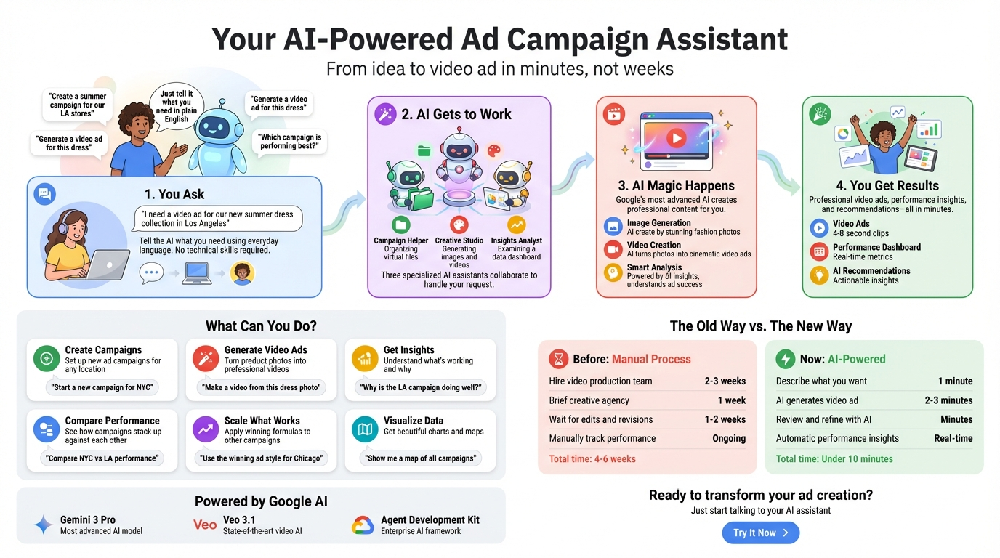
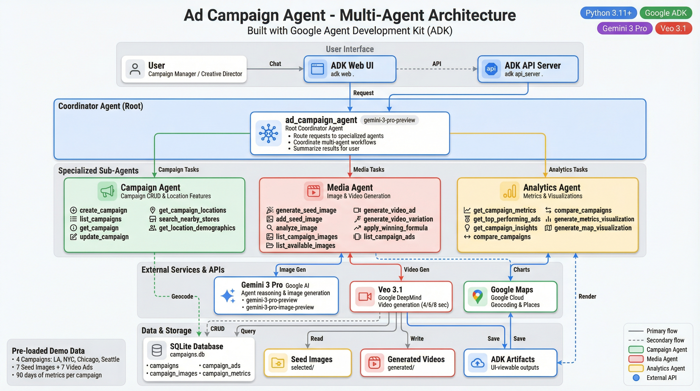

# Ad Campaign Agent

A multi-agent ADK system for fashion retail ad campaign management, showcasing the end-to-end journey from campaign creation to AI-powered video ad generation using **Veo 3.1** and **Gemini 3 Pro**.

## How It Works

From idea to video ad in minutes, not weeks. Just tell the AI what you need in plain English.



**What Can You Do?**
- Create ad campaigns for any location
- Generate professional video ads from product photos
- Get AI-powered insights on what's working
- Compare performance across campaigns
- Scale winning formulas to other campaigns
- Visualize data with charts and maps

## Features

- **Multi-Agent Architecture**: Coordinator agent with 3 specialized sub-agents
- **Video Ad Generation**: Create cinematic fashion videos using Veo 3.1
- **AI Image Generation**: Generate seed images with Gemini 3 Pro Image
- **Image Analysis**: Extract fashion metadata (garment type, mood, setting, etc.)
- **Campaign Management**: Full CRUD operations with location targeting
- **Performance Analytics**: Metrics tracking, insights, and visualizations
- **Map Visualizations**: Geographic campaign performance views
- **Winning Formula**: Scale top-performing ad characteristics to other campaigns

## Architecture

### High-Level Overview


The system uses a hierarchical multi-agent architecture:
- **Coordinator Agent**: Routes requests to specialized sub-agents
- **Campaign Agent** (7 tools): Campaign CRUD, location targeting, store search
- **Media Agent** (9 tools): AI image/video generation, winning formula scaling
- **Analytics Agent** (6 tools): Performance metrics, insights, visualizations

### Detailed System Design

For a comprehensive view of all 22 tools, data flows, and external service integrations:



## Quick Start

### Prerequisites

- Python 3.11+
- Google Cloud project with enabled APIs:
  - Generative AI API (Gemini)
  - Vertex AI API (for Veo 3.1)
  - Maps API (optional, for location features)

### Installation

```bash
# Clone the repository
git clone https://github.com/lavinigam-gcp/build-with-adk.git
cd build-with-adk/ad-campaign-agent

# Install dependencies
pip install google-adk google-genai googlemaps Pillow

# Set environment variables
export GOOGLE_API_KEY="your-gemini-api-key"
export GOOGLE_MAPS_API_KEY="your-maps-api-key"  # Optional
```

### Run the Agent

```bash
# Web UI (recommended)
adk web .

# API Server
adk api_server .

# CLI
adk run .
```

## Project Structure

```
ad-campaign-agent/
├── app/
│   ├── __init__.py
│   ├── agent.py            # Multi-agent definitions
│   ├── config.py           # Configuration and paths
│   ├── database/
│   │   ├── db.py           # SQLite database connection
│   │   └── mock_data.py    # Demo data population
│   └── tools/
│       ├── campaign_tools.py   # Campaign CRUD operations
│       ├── image_tools.py      # Image generation & analysis
│       ├── video_tools.py      # Veo 3.1 video generation
│       ├── metrics_tools.py    # Analytics & visualizations
│       └── maps_tools.py       # Location & map features
├── selected/               # Seed images (static + AI-generated)
├── generated/              # Generated video ads
├── campaigns.db            # SQLite database with demo data
└── README.md
```

## Demo Flow

The agent comes pre-loaded with 4 demo campaigns and sample data:

| Campaign | Location | Category | Status |
|----------|----------|----------|--------|
| Summer Blooms 2025 | Los Angeles, CA | Summer | Active |
| Evening Elegance Collection | New York, NY | Formal | Active |
| Urban Professional | Chicago, IL | Professional | Active |
| Fall Essentials | Seattle, WA | Essentials | Draft |

### Example Interactions

**1. List campaigns:**
> "Show me all active campaigns"

**2. Generate a video ad:**
> "Generate a video ad for the Summer Blooms campaign"

**3. Get performance insights:**
> "What are the top performing ads and why?"

**4. Apply winning formula:**
> "Apply the winning characteristics from our best ad to the Urban Professional campaign"

**5. View campaigns on map:**
> "Show all campaigns on a map with performance metrics"

**6. Generate visualization:**
> "Create a revenue trendline chart for Summer Blooms"

## Tools Reference

### Campaign Agent Tools

| Tool | Description |
|------|-------------|
| `create_campaign` | Create new campaign with name, category, location |
| `list_campaigns` | List all campaigns with optional status filter |
| `get_campaign` | Get detailed campaign info by ID |
| `update_campaign` | Update campaign properties or status |
| `get_campaign_locations` | Get all campaign locations with coordinates |
| `search_nearby_stores` | Find fashion stores near a location |
| `get_location_demographics` | Get demographic data for a city |

### Media Agent Tools

| Tool | Description |
|------|-------------|
| `generate_seed_image` | Create fashion image with Gemini 3 Pro Image |
| `add_seed_image` | Add existing image to a campaign |
| `analyze_image` | Extract metadata (garment, mood, setting, etc.) |
| `list_campaign_images` | List images associated with a campaign |
| `list_available_images` | List all images in selected/ folder |
| `generate_video_ad` | Create video ad with Veo 3.1 (4/6/8 seconds) |
| `generate_video_variation` | Create A/B test variant (setting/mood/angle/style) |
| `apply_winning_formula` | Scale top performer characteristics to other campaigns |
| `list_campaign_ads` | List all video ads for a campaign |

### Analytics Agent Tools

| Tool | Description |
|------|-------------|
| `get_campaign_metrics` | Get daily/aggregated performance metrics |
| `get_top_performing_ads` | Rank ads by revenue/impressions/engagement |
| `get_campaign_insights` | AI-generated insights and recommendations |
| `compare_campaigns` | Compare metrics across multiple campaigns |
| `generate_metrics_visualization` | Create charts (trendline/bar/comparison/infographic) |
| `generate_map_visualization` | Create map visualizations (performance/regional/heatmap) |

## AI Models Used

| Model | Purpose |
|-------|---------|
| `gemini-3-pro-preview` | Agent reasoning and coordination |
| `gemini-3-pro-image-preview` | Seed image generation, charts, maps |
| `veo-3.1-generate-preview` | Video ad generation (4/6/8 seconds) |

## Database Schema

```sql
campaigns (id, name, description, category, city, state, status, created_at)
campaign_images (id, campaign_id, image_path, metadata, created_at)
campaign_ads (id, campaign_id, image_id, video_path, prompt_used, duration_seconds, status, created_at)
campaign_metrics (id, campaign_id, ad_id, date, impressions, views, clicks, revenue, cost_per_impression, engagement_rate)
```

## Environment Variables

| Variable | Required | Description |
|----------|----------|-------------|
| `GOOGLE_API_KEY` | Yes | Gemini API key |
| `GOOGLE_MAPS_API_KEY` | No | Google Maps API key for location features |

## ADK Artifacts

Generated content is saved as ADK artifacts for viewing in the web UI:
- Video ads (MP4)
- Generated seed images (PNG)
- Chart visualizations (PNG)
- Map visualizations (PNG)

## License

Apache License 2.0 - See [LICENSE](../LICENSE)
