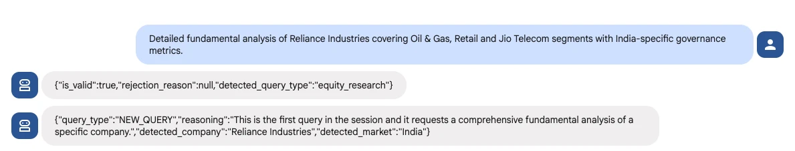
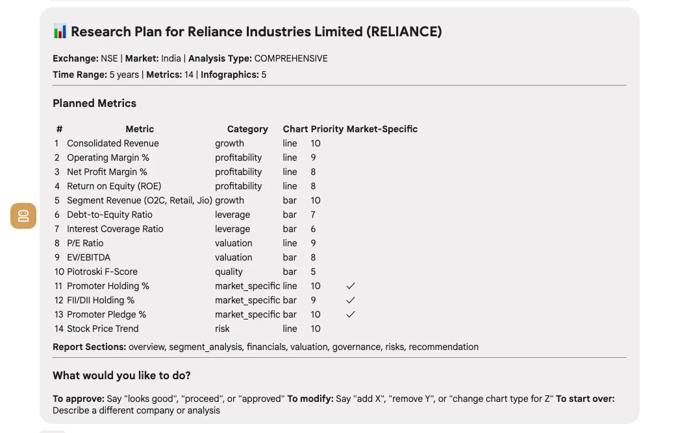
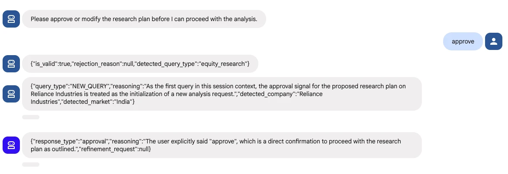
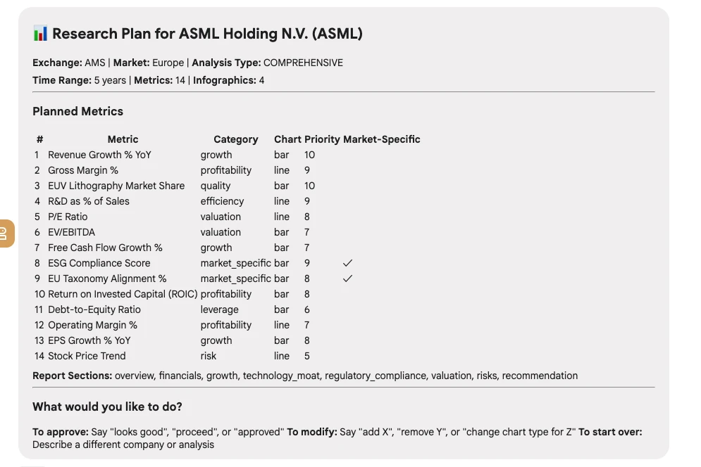
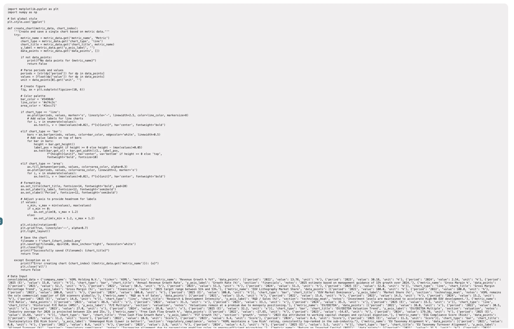
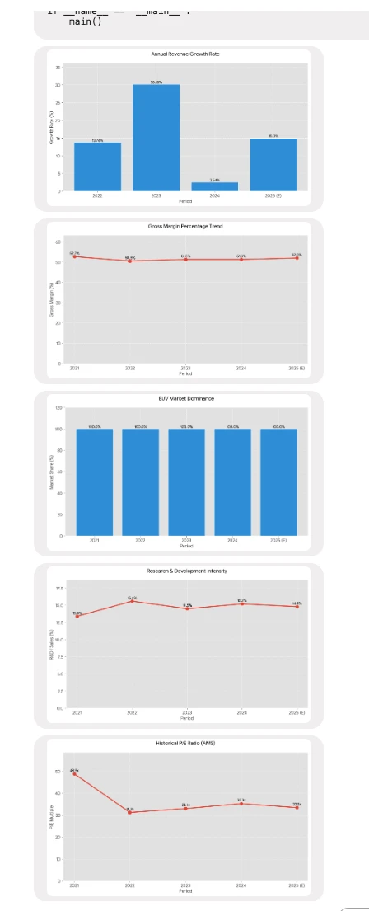
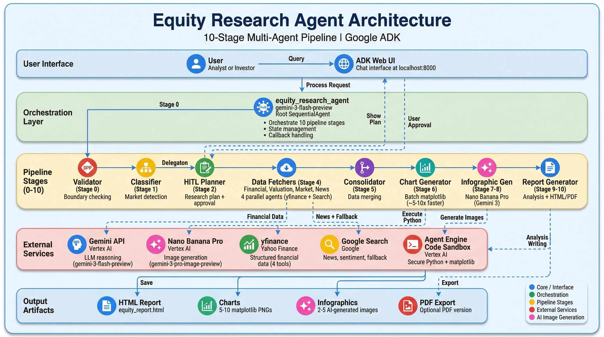
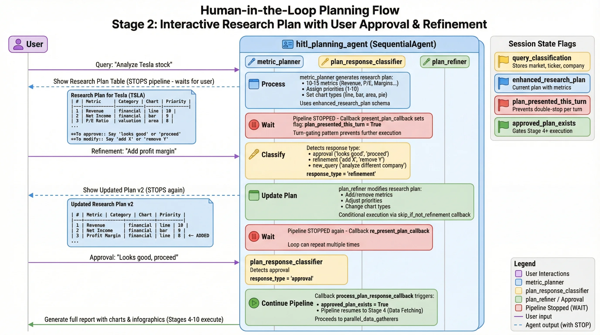

# Equity Research Report Agent with Google ADK

A multi-agent AI pipeline for professional-grade equity research reports, built with [Google Agent Development Kit (ADK)](https://google.github.io/adk-docs/) and Gemini on Google Cloud.

> **Google Cloud Required:** This sample requires an active Google Cloud account with Vertex AI APIs enabled. Chart generation uses Agent Engine Sandbox, and all LLM calls go through Gemini on Vertex AI.

<p align="center">
  
</p>

<table>
  <thead>
    <tr>
      <th colspan="2">Key Features</th>
    </tr>
  </thead>
  <tbody>
    <tr>
      <td>📊</td>
      <td><strong>Professional Reports:</strong> Investment-grade HTML & PDF reports with charts, infographics, and executive summaries.</td>
    </tr>
    <tr>
      <td>👥</td>
      <td><strong>Human-in-the-Loop Planning:</strong> Users review and approve research plans before execution begins.</td>
    </tr>
    <tr>
      <td>📈</td>
      <td><strong>Structured Data via yfinance:</strong> Financial statements, valuation metrics, and market data from Yahoo Finance with Google Search fallback.</td>
    </tr>
    <tr>
      <td>⚡</td>
      <td><strong>Batch Chart Generation:</strong> ~5-10x faster chart generation with single sandbox execution (all charts at once).</td>
    </tr>
    <tr>
      <td>🎨</td>
      <td><strong>AI Infographics:</strong> 2-5 contextual infographics via Gemini native image generation.</td>
    </tr>
    <tr>
      <td>🌍</td>
      <td><strong>Multi-Market Support:</strong> US, India, China, Japan, Korea, Europe with locale-specific metrics.</td>
    </tr>
    <tr>
      <td>🔒</td>
      <td><strong>Boundary Validation:</strong> Rejects unsupported queries (crypto, trading advice, private companies).</td>
    </tr>
    <tr>
      <td>☁️</td>
      <td><strong>Google Cloud Native:</strong> Vertex AI Gemini + Agent Engine Sandbox for secure code execution.</td>
    </tr>
  </tbody>
</table>

<p align="center">
  <br>
  <em>Agent Demo</em>
</p>

<p align="center">
  📊 <a href="#example-reports"><strong>See Example Reports →</strong></a>
</p>

## What It Does

Given a company query, this pipeline automatically:

1. **Validates** the query against boundary rules (rejects crypto, trading advice, etc.)
2. **Presents** an interactive research plan with 10-15 metrics for user approval
3. **Fetches** financial data via yfinance (structured) + Google Search (qualitative)
4. **Generates** 5-10 matplotlib charts in batch mode via Agent Engine Sandbox
5. **Creates** 2-5 AI-generated infographics with Gemini image generation
6. **Produces** a professional HTML report with optional PDF export

---

## Getting Started

### Prerequisites

| Requirement | Description |
|-------------|-------------|
| **Google Cloud Account** | Active account with billing enabled |
| **Vertex AI API** | Must be enabled in your GCP project |
| **Python 3.10+** | [Download](https://www.python.org/downloads/) |
| **Google Cloud SDK** | [Install gcloud CLI](https://cloud.google.com/sdk/docs/install) |

> **Note:** ADK CLI and all other dependencies are installed automatically by `make setup`.
>
> **Why Google Cloud?** This sample uses Vertex AI Gemini for LLM reasoning, Agent Engine Sandbox for secure Python code execution (charts), and Gemini image generation for infographics. These features require Google Cloud.

### Quick Start

```bash
# Clone and navigate
git clone https://github.com/lavinigam-gcp/build-with-adk.git
cd build-with-adk/adk-equity-deep-research

# Full setup: authenticates, installs dependencies, creates sandbox
make setup

# Run the agent
make dev
```

Open `http://localhost:8000`, select **"app"**, and try: *"Do a fundamental analysis of Apple"*

### Available Commands

| Command | Description |
|---------|-------------|
| `make setup` | **First-time setup** - Runs auth → install → env-setup → sandbox |
| `make dev` | Start the agent with ADK web UI at `http://localhost:8000` |
| `make install` | Install Python dependencies only (creates `.venv`) |
| `make auth` | Authenticate with Google Cloud only |
| `make sandbox` | Create Agent Engine Sandbox and update `.env` |
| `make sandbox-list` | List existing sandboxes in your project |
| `make clean` | Remove virtual environment and build artifacts |
| `make help` | Show all available commands |

> **Tip:** After initial setup, you only need `make dev` for daily use. Run `make setup` again if you need to recreate the sandbox or re-authenticate.

### Manual Setup (if not using Make)

<details>
<summary>Click to expand manual setup steps</summary>

#### Step 1: Authenticate with Google Cloud

```bash
gcloud auth login
gcloud auth application-default login
```

#### Step 2: Install Dependencies

```bash
python -m venv .venv && source .venv/bin/activate
pip install -r requirements.txt
```

#### Step 3: Create Environment File

```bash
cp .env.example .env
# Edit .env with your GCP project ID
```

#### Step 4: Create Sandbox for Chart Generation

```bash
python manage_sandbox.py create
# Copy the SANDBOX_RESOURCE_NAME to your .env file
```

#### Step 5: Run the Agent

```bash
cd app && adk web
```

</details>

### What You'll See

1. Open `http://localhost:8000` in your browser
2. Select **"app"** from the agent dropdown
3. Try a query: *"Do a fundamental analysis of Apple"*
4. Review the research plan when prompted
5. Approve with: *"Looks good, proceed"*

---

## Cloud Deployment

> **Note:** For production cloud deployment, use the [Agent Starter Pack](https://goo.gle/agent-starter-pack) to generate a deployment-ready project with CI/CD pipelines.

**Prerequisites:**
```bash
gcloud components update
gcloud config set project YOUR_PROJECT_ID
```

### Option 1: Cloud Run

Deploy with the built-in ADK web interface:

```bash
gcloud run deploy equity-research-agent \
  --source . \
  --region us-central1 \
  --allow-unauthenticated
```

### Option 2: Agent Engine

Deploy to Vertex AI Agent Engine for managed sessions:

```bash
# See ADK documentation for Agent Engine deployment
```

---

## Model & Data Configuration

| Component | Technology | Notes |
|-----------|------------|-------|
| **LLM Reasoning** | `gemini-3-flash-preview` | All agent reasoning via Vertex AI |
| **Image Generation** | `gemini-3-pro-image-preview` | Infographic generation |
| **Code Execution** | Agent Engine Sandbox | Secure Python for matplotlib charts |
| **Financial Data** | yfinance (Yahoo Finance) | Structured data: statements, metrics, prices |
| **News & Sentiment** | Google Search | Qualitative context and recent news |

---

<a id="example-reports"></a>

## Example Reports

Real-world analysis examples across different markets:

<table>
  <tr>
    <th align="center">🇺🇸 Alphabet (US)</th>
    <th align="center">🇮🇳 Reliance Industries (India)</th>
    <th align="center">🇪🇺 ASML Holding (Europe)</th>
  </tr>
  <tr>
    <td valign="top">
      <strong>Query:</strong> <em>"Comprehensive equity research on Alphabet covering Google Search, YouTube, Google Cloud, and Other Bets"</em><br><br>
      Multi-segment analysis with revenue breakdown and AI investment analysis.<br><br>
      📄 <a href="https://raw.githack.com/lavinigam-gcp/build-with-adk/main/adk-equity-deep-research/assets/alphabet-comprehensive-analysis.html" target="_blank">HTML</a> | 📑 <a href="https://raw.githack.com/lavinigam-gcp/build-with-adk/main/adk-equity-deep-research/assets/alphabet-comprehensive-analysis.pdf" target="_blank">PDF</a>
    </td>
    <td valign="top">
      <strong>Query:</strong> <em>"Fundamental analysis of Reliance Industries covering Oil & Gas, Retail, and Jio Telecom segments"</em><br><br>
      India-specific metrics: Promoter Holding %, FII/DII flows, conglomerate analysis.<br><br>
      📄 <a href="https://raw.githack.com/lavinigam-gcp/build-with-adk/main/adk-equity-deep-research/assets/reliance-india-analysis.html" target="_blank">HTML</a> | 📑 <a href="https://raw.githack.com/lavinigam-gcp/build-with-adk/main/adk-equity-deep-research/assets/reliance-india-analysis.pdf" target="_blank">PDF</a>
    </td>
    <td valign="top">
      <strong>Query:</strong> <em>"Equity research on ASML focusing on semiconductor equipment market and EUV technology moat"</em><br><br>
      European metrics: ESG scores, EU taxonomy alignment, tech leadership.<br><br>
      📄 <a href="https://raw.githack.com/lavinigam-gcp/build-with-adk/main/adk-equity-deep-research/assets/asml-europe-analysis.html" target="_blank">HTML</a> | 📑 <a href="https://raw.githack.com/lavinigam-gcp/build-with-adk/main/adk-equity-deep-research/assets/asml-europe-analysis.pdf" target="_blank">PDF</a>
    </td>
  </tr>
</table>

<details>
<summary>📸 View Process Screenshots</summary>

<table>
  <tr>
    <td align="center" width="33%">
      <br>
      <em>Query Classification</em>
    </td>
    <td align="center" width="33%">
      <br>
      <em>Research Plan Generation</em>
    </td>
    <td align="center" width="33%">
      <br>
      <em>User Approval</em>
    </td>
  </tr>
  <tr>
    <td align="center" width="33%">
      <br>
      <em>Research Plan</em>
    </td>
    <td align="center" width="33%">
      <br>
      <em>Batch Chart Code Generation</em>
    </td>
    <td align="center" width="33%">
      <br>
      <em>Charts Generated in Sandbox</em>
    </td>
  </tr>
</table>

</details>

---

## More Example Prompts to Try

Explore the agent's capabilities with these queries:

### US Markets
| Query | What It Does |
|-------|--------------|
| "Analyze Apple stock" | Quick fundamental analysis with key metrics |
| "Do a fundamental analysis of Microsoft" | Comprehensive fundamentals with profitability focus |
| "Equity research on NVIDIA focusing on AI chip revenue" | Sector-specific analysis with custom focus |
| "Comprehensive analysis of Amazon covering AWS, e-commerce, and advertising" | Multi-segment business analysis |
| "Compare Tesla's profitability metrics over the last 5 years" | Time-series focused analysis |

### International Markets
| Query | Market | What It Does |
|-------|--------|--------------|
| "Comprehensive analysis of Reliance Industries" | India | Includes Promoter Holding %, FII/DII flows |
| "Analyze Tata Consultancy Services with focus on margins" | India | IT sector with India-specific metrics |
| "Research Alibaba Group fundamentals" | China | Includes State Ownership %, regulatory context |
| "Equity analysis of Toyota Motor Corporation" | Japan | Includes Keiretsu affiliation metrics |
| "Analyze Samsung Electronics valuation" | Korea | Includes Chaebol structure analysis |
| "Fundamental analysis of ASML Holding" | Europe | Includes ESG scores, EU metrics |

### Advanced Queries
| Query | What It Does |
|-------|--------------|
| "Deep dive into Alphabet's revenue segments and growth drivers" | Multi-segment with growth analysis |
| "Analyze Meta Platforms focusing on Reality Labs losses and AI investments" | Specific segment deep-dive |
| "Comprehensive equity research on JPMorgan Chase covering net interest income, trading revenue, and credit quality" | Financial sector with banking-specific metrics |
| "Research Pfizer's pipeline and patent cliff analysis" | Healthcare with R&D focus |

### HITL Refinement Examples
After the agent presents a research plan, try these refinements:
- "Add gross margin and operating margin"
- "Remove the news sentiment metrics"
- "Focus more on valuation metrics"
- "Add 10-year historical data instead of 5"
- "Include competitor comparison with AMD"

---

## Architecture

<p align="center">
  
</p>

The pipeline orchestrates 10+ specialized agents in a sequential flow:

| Stage | Agent | Description |
|-------|-------|-------------|
| 1 | **Query Validator** | Rejects unsupported queries (crypto, trading advice, etc.) |
| 2 | **Query Classifier** | Detects market (US, India, Japan, etc.) and query type |
| 3 | **HITL Planning** | Generates research plan, waits for user approval |
| 4 | **Parallel Data Fetchers** | 4 agents fetch data via **yfinance** + Google Search fallback |
| 5 | **Data Consolidator** | Merges structured data for charting |
| 6 | **Batch Chart Generator** | Creates all charts in single sandbox execution (~5-10x faster) |
| 7 | **Infographic Generator** | Generates 2-5 AI infographics via Gemini |
| 8 | **Analysis Writer** | Writes narrative with Setup→Visual→Interpretation pattern |
| 9 | **HTML Report Generator** | Produces final report with embedded visuals |

### Data Fetcher Pipeline

<p align="center">
  
</p>

**Why yfinance?** Structured, deterministic financial data from Yahoo Finance. Google Search is used as fallback and for qualitative news/sentiment.

---

## Supported Markets

| Market | Exchanges | Market-Specific Metrics |
|--------|-----------|------------------------|
| **US** | NYSE, NASDAQ | Standard metrics |
| **India** | NSE, BSE | Promoter Holding %, FII/DII Flows |
| **China** | SSE, SZSE, HKEX | State Ownership %, A/H-Share Premium |
| **Japan** | TSE | Keiretsu Affiliation, Cross-Shareholding |
| **Korea** | KRX, KOSDAQ | Chaebol Affiliation, Foreign Ownership |
| **Europe** | LSE, Euronext, XETRA | ESG Score, EU Taxonomy Alignment |

Markets are auto-detected from company names (e.g., "Reliance" → India, "Toyota" → Japan).

---

## HITL Planning Flow

<p align="center">
  
</p>

---

## Authors

**Lavi Nigam**
[](https://github.com/lavinigam-gcp)
[](https://www.linkedin.com/in/lavinigam/)
[](https://x.com/lavinigam)

---

## Disclaimer

This agent sample is provided for illustrative purposes only. It serves as a basic example of an agent and a foundational starting point for individuals or teams to develop their own agents.

**Not Financial Advice:** This tool is a technology demonstration only. The reports, analysis, and data generated by this agent do not constitute investment advice, stock recommendations, or financial guidance of any kind. The outputs should not be used as the basis for any investment decisions. Always consult with a qualified financial advisor before making investment decisions.

Users are solely responsible for any further development, testing, security hardening, and deployment of agents based on this sample.

---

## License

Apache 2.0 - See [LICENSE](LICENSE) for details.
