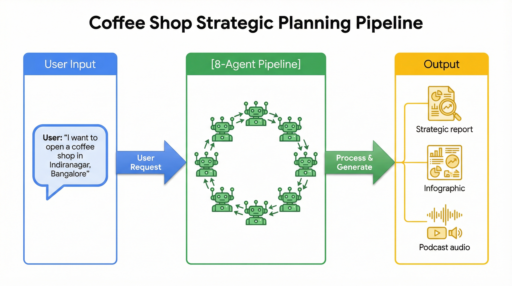
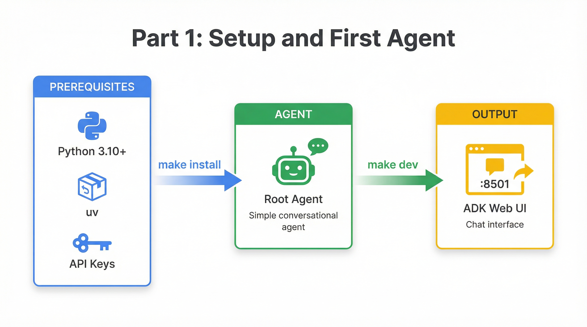

# Part 1: Setup and Your First Agent

By the end of this part, you'll have a working agent running on `adk web` at `http://localhost:8501`.

<p align="center">
  
</p>

## The Problem We're Solving

Opening a physical retail location is one of the highest-stakes decisions a business can make. A bad location can doom even the best concept, while the right spot can turn a modest idea into a thriving business. Yet the data needed to make this decision is scattered across dozens of sources.

Demographics live on government websites and Wikipedia. Competitor information is buried in Google Maps listings. Rent trends appear in local news articles and real estate reports. Foot traffic patterns require purchasing expensive datasets. And synthesizing all of this into actionable insights? That typically happens in spreadsheets, with analysts spending 1-2 weeks per location just to produce a "good enough" recommendation.

The result is that most retail location decisions still come down to gut feeling, site visits, and intuition. Entrepreneurs guess. Franchises rely on formulaic checklists. Even sophisticated retailers struggle to systematically evaluate new markets.

### What We'll Build

This tutorial series takes a different approach. We'll build an AI-powered pipeline that unifies these fragmented data sources into a coherent location strategy—in minutes rather than weeks.

<p align="center">
  
</p>

When a user says *"I want to open a coffee shop in Indiranagar, Bangalore"*, our pipeline will:

1. **Parse the request** — Extract the location and business type from natural language
2. **Research the market** — Search the web for demographics, trends, and local characteristics
3. **Map competitors** — Query Google Maps to find existing businesses in the area
4. **Analyze gaps** — Execute Python code to calculate viability scores and identify opportunities
5. **Synthesize strategy** — Use extended reasoning to generate strategic recommendations
6. **Generate artifacts** — Produce an HTML executive report, a visual infographic, and a podcast-style audio summary

By the end of this series, you'll understand not just *how* this pipeline works, but *why* each architectural decision was made. You'll be equipped to adapt the pattern for your own multi-agent applications.

But first, let's get a basic agent running.

---

## Prerequisites

Before diving in, make sure you have the following installed and configured:

- **[Python 3.10-3.12](https://www.python.org/downloads/)** — ADK requires this specific version range due to dependencies
- **[uv](https://github.com/astral-sh/uv)** — A fast Python package manager that we'll use instead of pip (recommended but not required)
- **[Google AI Studio API Key](https://aistudio.google.com/app/apikey)** — This gives you access to Gemini models for development
- **[Google Maps API Key](https://console.cloud.google.com/apis/credentials)** — You'll need the Places API enabled for competitor mapping

If you're planning to deploy to production, you'll also want a Google Cloud project with Vertex AI enabled, but that's covered in [Part 9](./09-production-deployment.md).

---

## Clone and Setup

### Step 1: Clone the Repository

Start by cloning the repository and navigating to the project directory:

```bash
git clone https://github.com/lavinigam-gcp/build-with-adk.git
cd build-with-adk/retail-ai-location-strategy
```

### Step 2: Configure Your API Keys

ADK expects environment variables to be set in a `.env` file inside the `app/` folder. This is a common gotcha—the file must be in `app/.env`, not in the project root.

Create the file with your API keys:

```bash
echo "GOOGLE_GENAI_USE_VERTEXAI=FALSE" >> app/.env
echo "GOOGLE_API_KEY=YOUR_AI_STUDIO_API_KEY" >> app/.env
echo "MAPS_API_KEY=YOUR_MAPS_API_KEY" >> app/.env
```

Replace the placeholder values with your actual keys. You can also copy the example file and edit it:

```bash
cp app/.env.example app/.env
# Then edit app/.env with your actual keys
```

> **Why is `.env` inside `app/`?** ADK loads environment variables relative to the agent package, not the project root. This convention keeps your keys close to where they're used and makes it easier to have different configurations for different agents.

---

## Understanding ADK Project Structure

Before we run anything, let's take a tour of the project structure. Understanding these conventions will save you hours of debugging later.

```
retail-ai-location-strategy/
├── Makefile                 # Build commands: dev, test, deploy
├── pyproject.toml           # Python dependencies
│
├── app/                     # ADK discovers agents here
│   ├── __init__.py          # Exports root_agent (required!)
│   ├── agent.py             # Root agent definition
│   ├── config.py            # Model and retry settings
│   ├── .env                 # Your API keys
│   │
│   ├── sub_agents/          # Specialized agents (we'll build these)
│   ├── tools/               # Custom function tools
│   ├── callbacks/           # Lifecycle hooks
│   └── schemas/             # Pydantic output schemas
```

The most important file is `app/__init__.py`. ADK uses a discovery mechanism to find your agent, and it specifically looks for an exported `root_agent` variable:

```python
# app/__init__.py
from app import agent
from app.agent import root_agent

__all__ = ["agent", "root_agent"]
```

If you forget to export `root_agent`, ADK won't be able to find your agent, and you'll see confusing "no agents found" errors. This is probably the most common mistake when starting with ADK.

> **Learn more:** The [ADK Quickstart Guide](https://google.github.io/adk-docs/get-started/quickstart/) covers project structure in detail.

---

## Model Configuration

The `app/config.py` file controls which Gemini models your agents use. Let's look at the key settings:

```python
# app/config.py (key sections)

import os

# Detect authentication mode from environment
USE_VERTEX_AI = os.environ.get("GOOGLE_GENAI_USE_VERTEXAI", "FALSE").upper() == "TRUE"

# Model Configuration - these are the models your agents will use
FAST_MODEL = "gemini-2.5-pro"          # Main processing
PRO_MODEL = "gemini-2.5-pro"           # Complex reasoning
CODE_EXEC_MODEL = "gemini-2.5-pro"     # Code execution tasks
IMAGE_MODEL = "gemini-3-pro-image-preview"  # Image generation
TTS_MODEL = "gemini-2.5-flash-preview-tts"  # Text-to-speech

# Retry Configuration - handles transient API errors gracefully
RETRY_INITIAL_DELAY = 5
RETRY_ATTEMPTS = 5
RETRY_MAX_DELAY = 60

APP_NAME = "retail_location_strategy"
```

This configuration serves two purposes. First, it centralizes model selection so you can easily switch between Gemini versions (2.5 Pro, 3 Pro Preview, Flash) without editing multiple files. Second, it handles the distinction between Google AI Studio (for development) and Vertex AI (for production) automatically based on environment variables.

The retry configuration is particularly important for production use. Gemini models occasionally return transient errors, especially during peak usage. These settings ensure your pipeline gracefully retries rather than failing immediately.

---

## Understanding the Root Agent

Now let's examine the heart of our application: the root agent. Open `app/agent.py` and you'll find something like this:

```python
# app/agent.py (simplified for clarity)
from google.adk.agents import SequentialAgent
from google.adk.agents.llm_agent import Agent
from google.adk.tools.agent_tool import AgentTool

from .config import FAST_MODEL, APP_NAME
from .sub_agents import intake_agent, location_strategy_pipeline

root_agent = Agent(
    model=FAST_MODEL,
    name=APP_NAME,
    description='A strategic partner for retail businesses, guiding them to optimal physical locations.',
    instruction="""Your primary role is to orchestrate the retail location analysis.

1. Start by greeting the user.
2. Check if the TARGET_LOCATION and BUSINESS_TYPE have been provided.
3. If they are missing, ask the user clarifying questions.
4. Once you have the details, call the IntakeAgent tool to process them.
5. After IntakeAgent succeeds, delegate to the LocationStrategyPipeline.

Your main function is to manage this workflow conversationally.""",
    sub_agents=[location_strategy_pipeline],
    tools=[AgentTool(intake_agent)],
)
```

Let's break down what each parameter does:

| Parameter | Purpose |
|-----------|---------|
| `model` | The Gemini model this agent uses for reasoning |
| `name` | A unique identifier for the agent (appears in logs and UI) |
| `description` | Human-readable description (shown in ADK web UI) |
| `instruction` | The system prompt that guides the agent's behavior |
| `sub_agents` | Other agents this agent can delegate entire conversations to |
| `tools` | Functions or wrapped agents this agent can call as tools |

The distinction between `sub_agents` and `tools` is subtle but important. When you add an agent to `sub_agents`, the root agent can hand off control entirely—the sub-agent takes over the conversation. When you wrap an agent with `AgentTool` and add it to `tools`, the root agent calls it like a function and gets results back, but retains control of the conversation.

In our case, `IntakeAgent` is wrapped as a tool because we want to call it and get structured data back. `LocationStrategyPipeline` is a sub-agent because once intake is complete, we want it to run the full analysis pipeline.

> **Learn more:** The [ADK Agents documentation](https://google.github.io/adk-docs/agents/) explains the different agent types and when to use each.

---

## Your First Agent (Simplified)

The complete agent has several sub-agents and tools wired up, but understanding the structure is easier with a minimal example. Here's what a basic conversational agent looks like:

```python
# A minimal root_agent (for learning purposes)
from google.adk.agents.llm_agent import Agent

root_agent = Agent(
    model="gemini-2.5-pro",
    name="retail_location_strategy",
    description="Helps find optimal retail locations",
    instruction="""You help users find locations for retail businesses.

When a user provides a location and business type, acknowledge them and
explain that you'll analyze the market for them.

For now, just have a conversation. We'll add analysis capabilities next.""",
)
```

This is just a conversational agent—no tools, no sub-agents. But it's fully functional. ADK will load it, and you can chat with it through the web interface. The agent will follow your instruction prompt and have natural conversations about retail locations.

As we progress through this series, we'll add tools for web search, Google Maps integration, code execution, and more. Each addition builds on this foundation.

---

## Run It!

### Step 3: Install Dependencies

From the `retail-ai-location-strategy` directory, install all required packages:

```bash
make install
```

This command uses `uv` under the hood to install dependencies from `pyproject.toml`. If you don't have `uv` installed, the Makefile will fall back to pip, but installation will be slower.

### Step 4: Start the Development Server

Launch the ADK web interface:

```bash
make dev
```

This runs `adk web app --port 8501`, which starts a local development server with a chat interface for testing your agent.

> **Learn more:** The [ADK Web documentation](https://google.github.io/adk-docs/get-started/quickstart/#step-3-interact-with-your-agent) covers all the features of the development interface.

### What You'll See

1. Open `http://localhost:8501` in your browser
2. Select **"app"** from the agent dropdown (this is your `APP_NAME` from config)
3. Try a query like: *"I want to open a coffee shop in Bangalore"*

The agent will respond and start processing your request. You'll notice it does much more than just chat—it searches the web, finds competitors on Google Maps, runs Python code for analysis, and generates a full strategic report with an infographic and audio summary.

**Wait, why does the full pipeline run?** You cloned a complete, working agent. The codebase already contains all the sub-agents, tools, and callbacks we'll explore in this series. This is intentional.

Think of this series as a "reverse engineering" journey. You have the finished product running right now. Over the next parts, we'll dissect each component to understand how it contributes to the whole. By Part 7, you'll understand every agent, tool, and callback that makes this pipeline work—and you'll know how to build your own.

---

## What's Happening Under the Hood

When you send a message to the agent, here's the flow:

1. **ADK receives the request** and routes it to your `root_agent`
2. **The root agent processes it** using the Gemini model specified in `config.py`
3. **Based on the instruction prompt**, it decides what action to take
4. **If tools are needed**, the agent calls them and incorporates the results
5. **If sub-agents are involved**, control may transfer to them for specialized processing
6. **The response streams back** to the web UI in real-time

For our complete agent, a typical request flows through:
- `IntakeAgent` — Parses the user's request into structured data
- `MarketResearchAgent` — Searches the web for market information
- `CompetitorMappingAgent` — Queries Google Maps for competitors
- `GapAnalysisAgent` — Runs Python code to analyze opportunities
- `StrategyAdvisorAgent` — Synthesizes recommendations with extended reasoning
- `ArtifactGenerationPipeline` — Generates report, infographic, and audio in parallel

We'll build each of these in the upcoming parts.

---

## Configuration Options

### Switching Models

Different Gemini models offer different tradeoffs between capability, speed, and cost. Edit `app/config.py` to experiment:

```python
# Option 1: Gemini 2.5 Pro (RECOMMENDED - stable and capable)
FAST_MODEL = "gemini-2.5-pro"

# Option 2: Gemini 3 Pro Preview (latest features, may have availability issues)
# FAST_MODEL = "gemini-3-pro-preview"

# Option 3: Gemini 2.5 Flash (fastest and cheapest, good for testing)
# FAST_MODEL = "gemini-2.5-flash"
```

For development, Gemini 2.5 Pro offers the best balance. Flash is great when you want faster iteration and lower costs. Gemini 3 Pro Preview has the latest capabilities but may experience "model overloaded" errors during peak times.

### Using Vertex AI for Production

Google AI Studio keys are perfect for development, but production deployments should use Vertex AI for better reliability, security, and enterprise features.

Update your `app/.env`:

```bash
GOOGLE_GENAI_USE_VERTEXAI=TRUE
GOOGLE_CLOUD_PROJECT=your-project-id
GOOGLE_CLOUD_LOCATION=us-central1
```

Then authenticate with Google Cloud:

```bash
gcloud auth application-default login
```

We'll cover production deployment in detail in [Part 9: Production Deployment](./09-production-deployment.md).

---

## What You've Learned

In this first part, you've accomplished quite a bit:

- **Understood the problem space** — Retail location decisions require synthesizing fragmented data from many sources
- **Set up your development environment** — Cloned the repo, configured API keys, installed dependencies
- **Learned ADK project conventions** — The `app/__init__.py` export pattern, the `.env` file location
- **Explored the root agent** — How `instruction`, `tools`, and `sub_agents` work together
- **Ran the complete pipeline** — Saw the end-to-end agent in action on `adk web`

You have a working agent. Now let's understand how it works, piece by piece.

---

## Troubleshooting

### "ModuleNotFoundError" or Import Errors

This usually means dependencies weren't installed correctly. Make sure you're in the right directory and run install again:

```bash
cd build-with-adk/retail-ai-location-strategy
make install
```

### "GOOGLE_API_KEY not set" or Authentication Errors

Your `.env` file must be inside the `app/` folder, not in the project root:

```bash
# Check if the file exists in the right place
ls app/.env

# If missing, create it
echo "GOOGLE_GENAI_USE_VERTEXAI=FALSE" > app/.env
echo "GOOGLE_API_KEY=your-actual-key" >> app/.env
echo "MAPS_API_KEY=your-maps-key" >> app/.env
```

### "Model not found" or 404 Errors

Some preview models have limited availability. Switch to stable models in `app/config.py`:

```python
FAST_MODEL = "gemini-2.5-pro"  # Stable, widely available
# FAST_MODEL = "gemini-3-pro-preview"  # May have availability issues
```

### Port 8501 Already in Use

Either kill the existing process or specify a different port:

```bash
make dev PORT=8502
```

---

## Quick Reference

| Command | What It Does |
|---------|--------------|
| `make install` | Install all Python dependencies |
| `make dev` | Start development server at localhost:8501 |
| `make test` | Run the test suite |

**Files referenced in this part:**
- [`app/__init__.py`](../app/__init__.py) — Agent export (required for ADK discovery)
- [`app/config.py`](../app/config.py) — Model and environment configuration
- [`app/agent.py`](../app/agent.py) — Root agent definition

**ADK Documentation:**
- [Quickstart Guide](https://google.github.io/adk-docs/get-started/quickstart/) — Getting started with ADK
- [Agent Types](https://google.github.io/adk-docs/agents/) — Understanding LlmAgent, SequentialAgent, ParallelAgent
- [ADK Web Interface](https://google.github.io/adk-docs/get-started/quickstart/#step-3-interact-with-your-agent) — Using the development UI

---

## Next: IntakeAgent — Parsing Natural Language

Now that you have a working agent, the question is: how does it understand what you're asking? When you say "coffee shop in Bangalore," how does the agent know to extract "coffee shop" as the business type and "Bangalore" as the location?

In **[Part 2: IntakeAgent](./02-intake-agent.md)**, we'll explore how the IntakeAgent uses structured output and few-shot prompting to transform natural language into clean, reliable data. This parsing step is the foundation that enables every subsequent agent to work with consistent inputs.

The transformation looks like this:

**Input:** *"I want to open a coffee shop in Indiranagar, Bangalore"*

**Output:**
```json
{
  "target_location": "Indiranagar, Bangalore, India",
  "business_type": "coffee shop"
}
```

Understanding this pattern will prepare you for building agents that need to extract structured information from unstructured user input—one of the most common challenges in production AI systems.

---

**[Continue to Part 2: IntakeAgent →](./02-intake-agent.md)**
