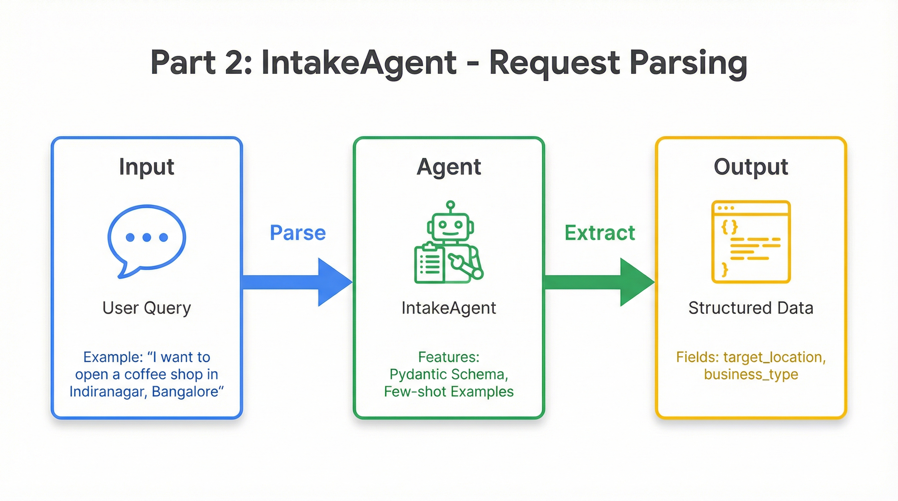

# Part 2: Request Parsing with IntakeAgent

In the previous part, you got a working agent running on `adk web`. But when you typed "I want to open a coffee shop in Bangalore," how did the pipeline know to extract "coffee shop" as the business type and "Bangalore" as the location?

That's the job of the **IntakeAgent**—and by the end of this part, you'll understand exactly how it transforms messy natural language into clean, structured data.

<p align="center">
  
</p>

---

## The Challenge: Bridging Natural Language and Structured Data

Users don't speak in JSON. They say things like:

- *"I want to open a coffee shop in Indiranagar, Bangalore"*
- *"Analyze the market for a new gym in downtown Seattle"*
- *"Help me find the best location for a bakery in Mumbai"*
- *"Where should I open my restaurant in San Francisco's Mission District?"*

Each of these sentences contains the same two pieces of information—a location and a business type—but expressed in completely different ways. The location might come before or after the business type. It might be a neighborhood, a city, or a region. The business type might be explicit ("coffee shop") or implied ("restaurant").

Our downstream agents need structured data they can rely on. The MarketResearchAgent needs to know exactly what location to search for. The CompetitorMappingAgent needs the business type to query Google Maps. Without consistent, structured inputs, the entire pipeline falls apart.

The IntakeAgent solves this problem by combining two powerful techniques: **Pydantic schemas** for type-safe output and **few-shot prompting** for reliable extraction.

---

## Defining the Output Schema

The first step is to define exactly what structure we want. In `app/sub_agents/intake_agent/agent.py`, we create a Pydantic model:

```python
from typing import Optional
from pydantic import BaseModel, Field

class UserRequest(BaseModel):
    """Structured output for parsing user's location strategy request."""

    target_location: str = Field(
        description="The geographic location/area to analyze (e.g., 'Indiranagar, Bangalore', 'Manhattan, New York')"
    )
    business_type: str = Field(
        description="The type of business the user wants to open (e.g., 'coffee shop', 'bakery', 'gym', 'restaurant')"
    )
    additional_context: Optional[str] = Field(
        default=None,
        description="Any additional context or requirements mentioned by the user"
    )
```

This schema does more than just define field names. The `Field(description=...)` annotations are crucial—they tell Gemini what each field means and what kind of values to put there. When ADK sends this schema to the model, Gemini understands that `target_location` should be a geographic area like "Indiranagar, Bangalore" rather than something abstract like "a busy area."

Using Pydantic gives us several benefits:

| Benefit | How It Helps |
|---------|--------------|
| **Type safety** | Gemini knows to output strings, not numbers or objects |
| **Field descriptions** | The LLM understands the semantic meaning of each field |
| **Automatic validation** | ADK validates the response matches the schema |
| **IDE support** | You get autocomplete and type hints when accessing the data |

> **Learn more:** The [ADK Structured Output documentation](https://google.github.io/adk-docs/agents/llm-agents/#structured-output) explains how schemas work with different model providers.

---

## Few-Shot Prompting for Reliable Extraction

A schema tells Gemini *what* to output, but few-shot examples show it *how*. The IntakeAgent's instruction includes multiple examples that demonstrate the expected behavior:

```python
INTAKE_INSTRUCTION = """You are a request parser for a retail location intelligence system.

Your task is to extract the target location and business type from the user's request.

## Examples

User: "I want to open a coffee shop in Indiranagar, Bangalore"
→ target_location: "Indiranagar, Bangalore"
→ business_type: "coffee shop"

User: "Analyze the market for a new gym in downtown Seattle"
→ target_location: "downtown Seattle"
→ business_type: "gym"

User: "Help me find the best location for a bakery in Mumbai"
→ target_location: "Mumbai"
→ business_type: "bakery"

User: "Where should I open my restaurant in San Francisco's Mission District?"
→ target_location: "Mission District, San Francisco"
→ business_type: "restaurant"

## Instructions
1. Extract the geographic location mentioned by the user
2. Identify the type of business they want to open
3. Note any additional context or requirements

If the user doesn't specify a clear location or business type, make a reasonable inference or ask for clarification.
"""
```

These examples aren't just documentation—they're training data. Each example shows a different phrasing pattern, teaching the model to handle variations:

- Business type before location: *"coffee shop in Bangalore"*
- Location before business type: *"downtown Seattle for a gym"*
- Neighborhood-level specificity: *"Mission District, San Francisco"*
- City-level generality: *"Mumbai"*

Few-shot prompting is remarkably effective for parsing tasks. The model learns the pattern from examples and generalizes to new inputs, even ones with phrasings it hasn't seen before.

---

## Building the IntakeAgent

With the schema and instruction defined, building the agent is straightforward:

```python
from google.adk.agents import LlmAgent
from google.genai import types

from ...config import FAST_MODEL, RETRY_INITIAL_DELAY, RETRY_ATTEMPTS

intake_agent = LlmAgent(
    name="IntakeAgent",
    model=FAST_MODEL,
    description="Parses user request to extract target location and business type",
    instruction=INTAKE_INSTRUCTION,
    generate_content_config=types.GenerateContentConfig(
        http_options=types.HttpOptions(
            retry_options=types.HttpRetryOptions(
                initial_delay=RETRY_INITIAL_DELAY,
                attempts=RETRY_ATTEMPTS,
            ),
        ),
    ),
    output_schema=UserRequest,
    output_key="parsed_request",
    after_agent_callback=after_intake,
)
```

Let's examine the key parameters:

| Parameter | What It Does |
|-----------|--------------|
| `output_schema=UserRequest` | Forces Gemini to return valid JSON matching the Pydantic schema |
| `output_key="parsed_request"` | Saves the parsed output to `state["parsed_request"]` |
| `after_agent_callback=after_intake` | Runs a function after parsing completes |
| `generate_content_config` | Configures retries for transient API errors |

The magic happens with `output_schema`. When you set this parameter, ADK instructs Gemini to output structured JSON rather than free-form text. The model's response is automatically validated against your Pydantic model, and if it doesn't match, ADK handles the error gracefully.

**Important caveat:** Setting `output_schema` disables tool calling for that agent. If you need an agent that both uses tools and produces structured output, you'll need to split it into two agents or use a callback to structure the output.

> **Learn more:** The [LlmAgent documentation](https://google.github.io/adk-docs/agents/llm-agents/) covers all available parameters.

---

## Post-Processing with Callbacks

After the IntakeAgent parses the request, we need to make the extracted values available to other agents. ADK uses **state injection**—the ability to reference state values in agent instructions using `{variable}` syntax. For this to work, we need individual state keys.

The `after_intake` callback handles this extraction:

```python
from google.adk.agents.callback_context import CallbackContext

def after_intake(callback_context: CallbackContext) -> Optional[types.Content]:
    """After intake, copy the parsed values to state for other agents."""
    parsed = callback_context.state.get("parsed_request", {})

    if isinstance(parsed, dict):
        # Handle dictionary output
        callback_context.state["target_location"] = parsed.get("target_location", "")
        callback_context.state["business_type"] = parsed.get("business_type", "")
        callback_context.state["additional_context"] = parsed.get("additional_context", "")
    elif hasattr(parsed, "target_location"):
        # Handle Pydantic model output
        callback_context.state["target_location"] = parsed.target_location
        callback_context.state["business_type"] = parsed.business_type
        callback_context.state["additional_context"] = parsed.additional_context or ""

    # Track stage completion for pipeline monitoring
    stages = callback_context.state.get("stages_completed", [])
    stages.append("intake")
    callback_context.state["stages_completed"] = stages

    return None  # Allow normal flow to continue
```

The callback checks whether the parsed output is a dictionary or a Pydantic model (ADK may return either depending on the situation) and extracts the values to individual keys. It also tracks which stages have completed, useful for debugging and UI updates.

Returning `None` tells ADK to continue with normal processing. If you returned a `types.Content` object instead, that would replace the agent's output—useful for overriding responses in certain conditions.

> **Learn more:** The [Callbacks documentation](https://google.github.io/adk-docs/callbacks/) explains the full callback lifecycle.

---

## Wiring IntakeAgent to the Root Agent

The IntakeAgent is connected to the root agent as a **tool** rather than a sub-agent. This distinction matters:

```python
# app/agent.py
from google.adk.tools.agent_tool import AgentTool
from .sub_agents.intake_agent.agent import intake_agent

root_agent = Agent(
    model=FAST_MODEL,
    name=APP_NAME,
    instruction="""Your primary role is to orchestrate the retail location analysis.
1. Start by greeting the user.
2. Check if the TARGET_LOCATION and BUSINESS_TYPE have been provided.
3. If they are missing, ask the user clarifying questions.
4. Once you have the details, call the IntakeAgent tool to process them.
5. After IntakeAgent succeeds, delegate to the LocationStrategyPipeline.
Your main function is to manage this workflow conversationally.""",
    tools=[AgentTool(intake_agent)],  # IntakeAgent wrapped as a tool
    sub_agents=[location_strategy_pipeline],
)
```

When you wrap an agent with `AgentTool`, the root agent can call it like a function. The root agent sends a message, the IntakeAgent processes it and returns structured data, and then the root agent continues with the conversation. This is different from adding an agent to `sub_agents`, which would hand off complete control.

Using IntakeAgent as a tool makes sense because we want the root agent to:
1. Have a conversation with the user
2. Call IntakeAgent to parse the request
3. Access the parsed results from state
4. Decide what to do next

The root agent stays in control throughout, using IntakeAgent as a utility for structured extraction.

> **Learn more:** The [AgentTool documentation](https://google.github.io/adk-docs/tools/agent-tool/) explains when to use tools vs sub-agents.

---

## Testing the IntakeAgent

Let's see it in action. Start the development server:

```bash
make dev
```

Open `http://localhost:8501` and try different query phrasings:

| Query | Expected Extraction |
|-------|---------------------|
| "Coffee shop in Bangalore" | location: "Bangalore", business: "coffee shop" |
| "Analyze downtown Seattle for a gym" | location: "downtown Seattle", business: "gym" |
| "Bakery in Mumbai" | location: "Mumbai", business: "bakery" |
| "Restaurant in Mission District, SF" | location: "Mission District, San Francisco", business: "restaurant" |

In the ADK web interface, watch the **State** panel on the right side. After the IntakeAgent runs, you'll see:

- `parsed_request` — The full structured output from the agent
- `target_location` — The extracted location string
- `business_type` — The extracted business type
- `stages_completed` — An array showing "intake" has completed

These state values are now available for every subsequent agent in the pipeline.

---

## Handling Edge Cases

Real users don't always provide complete information. Someone might say "I want to open a shop" without specifying where, or "Analyze Mumbai" without mentioning what business. The instruction handles this gracefully:

> *"If the user doesn't specify a clear location or business type, make a reasonable inference or ask for clarification."*

The model can:
- **Infer from context:** If someone asks about "a shop in the Haight," the model understands "Haight" likely means "Haight-Ashbury, San Francisco"
- **Request clarification:** If critical information is missing, the model can ask follow-up questions before producing structured output

The few-shot examples establish patterns the model can generalize from, making it robust to variations it hasn't explicitly seen.

---

## What You've Learned

In this part, you've explored how the IntakeAgent transforms natural language into structured data:

- **Pydantic schemas** define the shape of structured output, with field descriptions guiding the model
- **Few-shot prompting** teaches extraction patterns through examples, making parsing robust to variations
- **`output_schema` parameter** forces the model to return validated JSON matching your schema
- **`output_key` parameter** automatically saves the output to session state
- **Callbacks** enable post-processing, extracting individual values for downstream agents
- **`AgentTool`** wraps an agent so it can be called as a function from another agent

This pattern—structured output with few-shot examples—is foundational for any agent that needs to extract information from unstructured input. You'll use variations of it throughout your ADK projects.

---

## Quick Reference

| Concept | ADK Feature |
|---------|-------------|
| Structured output | `output_schema=PydanticModel` |
| Save to state | `output_key="key_name"` |
| Post-processing | `after_agent_callback=function` |
| Agent as callable tool | `AgentTool(agent)` |
| State access in callbacks | `callback_context.state["key"]` |
| State injection in prompts | `{variable_name}` syntax in instructions |

**Files referenced in this part:**
- [`app/sub_agents/intake_agent/agent.py`](../app/sub_agents/intake_agent/agent.py) — IntakeAgent definition and schema
- [`app/agent.py`](../app/agent.py) — Root agent with AgentTool integration

**ADK Documentation:**
- [Structured Output](https://google.github.io/adk-docs/agents/llm-agents/#structured-output) — Using Pydantic with LlmAgent
- [Agent Callbacks](https://google.github.io/adk-docs/callbacks/) — Lifecycle hooks for agents
- [AgentTool](https://google.github.io/adk-docs/tools/agent-tool/) — Wrapping agents as callable tools
- [Session State](https://google.github.io/adk-docs/sessions/state/) — How state flows between agents

---

## Next: Market Research with Google Search

We can now reliably parse user requests into structured data. But knowing that someone wants a "coffee shop in Indiranagar, Bangalore" is just the starting point. Is Indiranagar a good location? What are the demographics? Is the market saturated? What's the rental landscape like?

In **[Part 3: Market Research](./03-market-research.md)**, we'll build the MarketResearchAgent that uses ADK's built-in `google_search` tool to gather live market intelligence. The agent will search for demographics, local trends, foot traffic patterns, and rental rates—pulling current information that no static training dataset could provide.

You'll learn:
- How to use ADK's built-in `google_search` tool
- How state injection passes data between agents
- How to write prompts that guide effective web searches

---

**[← Back to Part 1: Setup](./01-setup-first-agent.md)** | **[Continue to Part 3: Market Research →](./03-market-research.md)**
