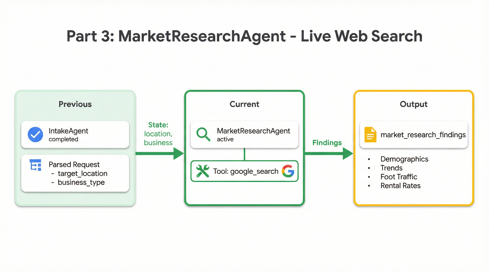

# Part 3: Live Market Research with Google Search

In the previous part, you built the IntakeAgent to extract structured data from user requests. Now we have clean inputs—a target location and business type—but we don't know anything *about* that location. Is it a good market? What are the demographics? What trends are shaping the area?

That's where the **MarketResearchAgent** comes in. By the end of this part, your agent will search the live web to gather real-time market intelligence.

<p align="center">
  
</p>

---

## Why Live Data Changes Everything

Large language models have a fundamental limitation: their knowledge has a cutoff date. Gemini might know that Indiranagar was a popular neighborhood in Bangalore as of its training, but it can't tell you:

- What new developments opened last quarter
- Current rental rates in the area
- Recent infrastructure changes like new metro lines
- Today's competitive landscape
- Emerging consumer trends

For location strategy, stale data is dangerous. A neighborhood that was "up and coming" two years ago might now be saturated with competitors. A formerly quiet area might have a new tech park driving foot traffic. Markets change fast, and your analysis needs to reflect reality.

The MarketResearchAgent solves this by tapping into ADK's built-in `google_search` tool. Instead of relying solely on the model's training data, it actively searches the web for current information—demographics from recent census data, news about developments, real estate listings, local business coverage, and more.

---

## What We're Researching

The agent investigates four key areas that determine location viability:

| Focus Area | What We're Looking For |
|------------|------------------------|
| **Demographics** | Age distribution, income levels, lifestyle indicators (professionals, students, families), population density |
| **Market Growth** | Population trends, new developments, infrastructure improvements, economic indicators |
| **Industry Presence** | Existing similar businesses, consumer preferences, market saturation, success/failure stories |
| **Commercial Viability** | Foot traffic patterns, rental costs, business environment, regulations |

Together, these paint a comprehensive picture of whether a location makes sense for a given business type.

---

## Using ADK's Built-in Google Search

One of ADK's most powerful features is its collection of built-in tools. For web search, you don't need to manage API keys or configure external services—Gemini has integrated search capabilities that ADK exposes through a simple import:

```python
from google.adk.tools import google_search
```

That's it. When you add `google_search` to an agent's tools, the agent can search the web and incorporate results into its reasoning. The search happens through Gemini's infrastructure, so there's no additional authentication or quota management on your end.

This is remarkably different from traditional approaches where you'd need to set up a Search API, handle rate limiting, parse results, and manage credentials. ADK abstracts all of that away.

> **Learn more:** The [Built-in Tools documentation](https://google.github.io/adk-docs/tools/built-in-tools/) covers all the tools ADK provides out of the box.

---

## The Research Instruction

The instruction prompt is where we define *what* the agent should research and *how* it should present findings. Here's the complete instruction:

```python
MARKET_RESEARCH_INSTRUCTION = """You are a market research analyst specializing in retail location intelligence.

Your task is to research and validate the target market for a new business location.

TARGET LOCATION: {target_location}
BUSINESS TYPE: {business_type}
CURRENT DATE: {current_date}

## Research Focus Areas

### 1. DEMOGRAPHICS
- Age distribution (identify key age groups)
- Income levels and purchasing power
- Lifestyle indicators (professionals, students, families)
- Population density and growth trends

### 2. MARKET GROWTH
- Population trends (growing, stable, declining)
- New residential and commercial developments
- Infrastructure improvements (metro, roads, tech parks)
- Economic growth indicators

### 3. INDUSTRY PRESENCE
- Existing similar businesses in the area
- Consumer preferences and spending patterns
- Market saturation indicators
- Success stories or failures of similar businesses

### 4. COMMERCIAL VIABILITY
- Foot traffic patterns (weekday vs weekend)
- Commercial real estate trends
- Typical rental costs (qualitative: low/medium/high)
- Business environment and regulations

## Instructions
1. Use Google Search to find current, verifiable data
2. Cite specific data points with sources where possible
3. Focus on information from the last 1-2 years for relevance
4. Be factual and data-driven, avoid speculation

## Output Format
Provide a structured analysis covering all four focus areas.
Conclude with a clear verdict: Is this a strong market for {business_type}? Why or why not?
Include specific recommendations for market entry strategy.
"""
```

### State Injection: The `{variable}` Syntax

Notice the placeholders in the instruction: `{target_location}`, `{business_type}`, and `{current_date}`. These aren't just template strings—they're ADK's **state injection** mechanism.

When the agent runs, ADK automatically replaces these placeholders with actual values from the session state:

- `{target_location}` → The location extracted by IntakeAgent (e.g., "Indiranagar, Bangalore")
- `{business_type}` → The business type from IntakeAgent (e.g., "coffee shop")
- `{current_date}` → Today's date, set by a callback (e.g., "2024-12-10")

This creates a seamless data flow between agents. The IntakeAgent writes to state, and the MarketResearchAgent reads from it—without any explicit parameter passing or API calls between them.

> **Learn more:** The [Session State documentation](https://google.github.io/adk-docs/sessions/state/) explains how state flows through multi-agent pipelines.

---

## Building the MarketResearchAgent

With the instruction defined, building the agent is straightforward:

```python
from google.adk.agents import LlmAgent
from google.adk.tools import google_search
from google.genai import types

from ...config import FAST_MODEL, RETRY_INITIAL_DELAY, RETRY_ATTEMPTS
from ...callbacks import before_market_research, after_market_research

market_research_agent = LlmAgent(
    name="MarketResearchAgent",
    model=FAST_MODEL,
    description="Researches market viability using Google Search for real-time demographics, trends, and commercial data",
    instruction=MARKET_RESEARCH_INSTRUCTION,
    generate_content_config=types.GenerateContentConfig(
        http_options=types.HttpOptions(
            retry_options=types.HttpRetryOptions(
                initial_delay=RETRY_INITIAL_DELAY,
                attempts=RETRY_ATTEMPTS,
            ),
        ),
    ),
    tools=[google_search],
    output_key="market_research_findings",
    before_agent_callback=before_market_research,
    after_agent_callback=after_market_research,
)
```

Let's break down the key parameters:

| Parameter | What It Does |
|-----------|--------------|
| `tools=[google_search]` | Gives the agent access to live web search |
| `output_key="market_research_findings"` | Saves the agent's output to state for downstream agents |
| `before_agent_callback` | Runs setup code before the agent executes |
| `after_agent_callback` | Runs cleanup/logging after the agent completes |

The `output_key` is particularly important. Whatever the agent produces gets stored in `state["market_research_findings"]`, making it available to subsequent agents in the pipeline. The CompetitorMappingAgent and GapAnalysisAgent can reference this research in their own instructions using `{market_research_findings}`.

---

## Lifecycle Callbacks for Logging and Setup

Callbacks let you run code before and after an agent executes. For MarketResearchAgent, we use them for logging, date injection, and pipeline tracking.

### The Before Callback

```python
from datetime import datetime
from google.adk.agents.callback_context import CallbackContext

def before_market_research(callback_context: CallbackContext) -> Optional[types.Content]:
    """Log start of market research phase and initialize pipeline tracking."""
    logger.info("=" * 60)
    logger.info("STAGE 1: MARKET RESEARCH - Starting")
    logger.info(f"  Target Location: {callback_context.state.get('target_location', 'Not set')}")
    logger.info(f"  Business Type: {callback_context.state.get('business_type', 'Not set')}")
    logger.info("=" * 60)

    # Set current date for state injection in agent instruction
    callback_context.state["current_date"] = datetime.now().strftime("%Y-%m-%d")

    # Initialize pipeline tracking
    callback_context.state["pipeline_stage"] = "market_research"
    callback_context.state["pipeline_start_time"] = datetime.now().isoformat()

    if "stages_completed" not in callback_context.state:
        callback_context.state["stages_completed"] = []

    return None  # Allow agent to proceed
```

This callback does several things. First, it logs the stage start with context about what's being analyzed—helpful for debugging and monitoring. Second, it sets `current_date` in state, which the instruction's `{current_date}` placeholder will pick up. This ensures the agent knows what "recent" means when searching for information from the last 1-2 years. Finally, it initializes tracking variables that help monitor pipeline progress.

Returning `None` tells ADK to proceed normally. If you returned a `types.Content` object instead, that would override the agent's execution entirely—useful for short-circuiting in certain conditions.

### The After Callback

```python
def after_market_research(callback_context: CallbackContext) -> Optional[types.Content]:
    """Log completion of market research and update tracking."""
    findings = callback_context.state.get("market_research_findings", "")
    findings_len = len(findings) if isinstance(findings, str) else 0

    logger.info(f"STAGE 1: COMPLETE - Market research findings: {findings_len} characters")

    # Update stages completed
    stages = callback_context.state.get("stages_completed", [])
    stages.append("market_research")
    callback_context.state["stages_completed"] = stages

    return None
```

The after callback logs completion and tracks that this stage finished. The `stages_completed` array is useful for debugging and for frontends that want to show pipeline progress.

> **Learn more:** The [Callbacks documentation](https://google.github.io/adk-docs/callbacks/) covers the full lifecycle and advanced patterns.

---

## Wiring into the Sequential Pipeline

The MarketResearchAgent is the first agent in the `LocationStrategyPipeline`, a `SequentialAgent` that runs each stage in order:

```python
from google.adk.agents import SequentialAgent
from .sub_agents.market_research.agent import market_research_agent

location_strategy_pipeline = SequentialAgent(
    name="LocationStrategyPipeline",
    description="Comprehensive retail location strategy analysis pipeline",
    sub_agents=[
        market_research_agent,        # Stage 1: Market research with search
        competitor_mapping_agent,     # Stage 2A: Competitor mapping with Maps
        gap_analysis_agent,           # Stage 2B: Gap analysis with code exec
        strategy_advisor_agent,       # Stage 3: Strategy synthesis
        artifact_generation_pipeline, # Stage 4: Artifacts (parallel)
    ],
)
```

`SequentialAgent` is one of ADK's workflow agents. It runs each sub-agent in order, with all agents sharing the same session state. When MarketResearchAgent writes to `state["market_research_findings"]`, that data is immediately available to CompetitorMappingAgent.

This is the power of ADK's architecture: you compose complex pipelines from simple, focused agents. Each agent does one thing well, and the framework handles the orchestration.

> **Learn more:** The [SequentialAgent documentation](https://google.github.io/adk-docs/agents/workflow-agents/#sequentialagent) covers configuration options and patterns.

---

## Testing the MarketResearchAgent

Let's see it in action. Start the development server:

```bash
make dev
```

Open `http://localhost:8501` and try a query like:

> "I want to open a coffee shop in Indiranagar, Bangalore"

Watch the output stream in. After IntakeAgent extracts the location and business type, you'll see MarketResearchAgent begin its research. The agent makes multiple searches, synthesizes the results, and produces a structured analysis.

In the **State** panel on the right, look for `market_research_findings`. It contains the full research output, which might look something like this:

```
## Demographics Analysis

Indiranagar is one of Bangalore's most affluent neighborhoods, characterized by:
- Population: High density, predominantly young professionals (25-40)
- Income level: Upper-middle to high income bracket
- Lifestyle: Tech professionals, startup founders, urban millennials

## Market Growth

Recent developments include:
- Metro Purple Line connectivity (operational since 2017)
- New coworking spaces and tech offices opening quarterly
- Increasing commercial real estate investment in 100 Feet Road corridor

## Industry Presence

Coffee culture is well-established with existing players:
- Third Wave Coffee: 2 locations in Indiranagar
- Blue Tokai: 1 location on 12th Main
- Starbucks: 2 locations
- Multiple local specialty cafes

## Commercial Viability

- High foot traffic, especially evenings and weekends
- Rental costs: Premium tier (₹150-200/sq ft)
- Strong purchasing power for specialty coffee (₹200-400 average ticket)

## Verdict

Strong market for a coffee shop. High disposable income, established coffee
culture, and young professional demographic create favorable conditions.
However, competition is significant—differentiation strategy required.
Consider: specialty roasts, work-friendly environment, or unique ambiance.
```

This is real, current information gathered from live web searches—not hallucinated from training data.

---

## What You've Learned

In this part, you've built the MarketResearchAgent and explored several key ADK concepts:

- **Built-in tools** like `google_search` provide powerful capabilities with minimal configuration
- **State injection** with `{variable}` syntax creates seamless data flow between agents
- **Lifecycle callbacks** enable logging, setup, and tracking without cluttering agent logic
- **SequentialAgent** orchestrates multi-step pipelines with shared state
- **`output_key`** makes agent output available to downstream agents automatically

The pattern here—focused agent, clear instruction, tool access, state integration—is the foundation for building sophisticated multi-agent systems.

---

## Quick Reference

| Feature | How to Use |
|---------|------------|
| Built-in search | `from google.adk.tools import google_search` |
| State injection | Use `{variable_name}` in instruction |
| Before callback | `before_agent_callback=function` |
| After callback | `after_agent_callback=function` |
| Sequential pipeline | `SequentialAgent(sub_agents=[...])` |
| Save output to state | `output_key="key_name"` |

**Files referenced in this part:**

- [`app/sub_agents/market_research/agent.py`](../app/sub_agents/market_research/agent.py) — MarketResearchAgent definition
- [`app/callbacks/pipeline_callbacks.py`](../app/callbacks/pipeline_callbacks.py) — Lifecycle callbacks
- [`app/agent.py`](../app/agent.py) — Pipeline orchestration

**ADK Documentation:**

- [Built-in Tools](https://google.github.io/adk-docs/tools/built-in-tools/) — google_search and other provided tools
- [SequentialAgent](https://google.github.io/adk-docs/agents/workflow-agents/#sequentialagent) — Running agents in sequence
- [Session State](https://google.github.io/adk-docs/sessions/state/) — State management and injection
- [Callbacks](https://google.github.io/adk-docs/callbacks/) — Lifecycle hooks for agents

---

## Next: Competitor Mapping with Google Maps

The market research tells us about the *opportunity*—demographics look good, growth is strong, coffee culture is established. But we're missing critical competitive intelligence. The search results mention competitors like "Third Wave Coffee" and "Blue Tokai," but how many locations do they actually have? What are their ratings? Where exactly are they positioned relative to our target location?

In **[Part 4: Competitor Mapping](./04-competitor-mapping.md)**, we'll build a **custom tool** that queries the Google Maps Places API. Instead of relying on search snippets, we'll get structured data directly from Google Maps—competitor names, ratings, review counts, addresses, and price levels.

You'll learn:
- How to create custom function tools with Python
- Using `ToolContext` to access session state from within tools
- Integrating external APIs with proper error handling
- When to build custom tools vs using built-in ones

---

**[← Back to Part 2: IntakeAgent](./02-intake-agent.md)** | **[Continue to Part 4: Competitor Mapping →](./04-competitor-mapping.md)**
