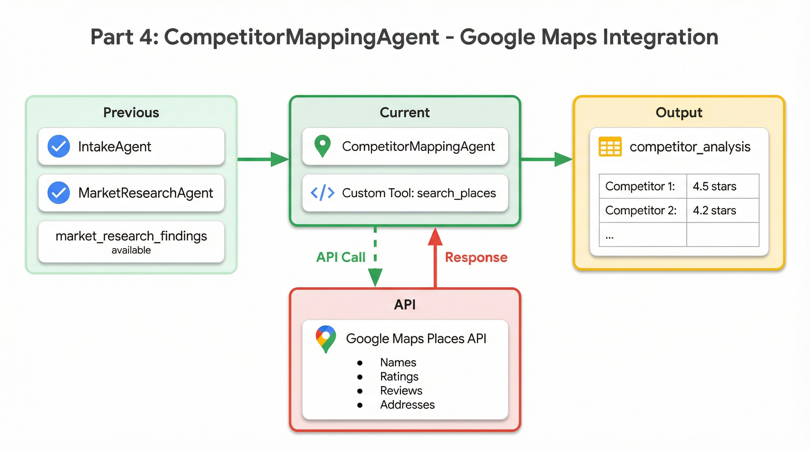

# Part 4: Competitor Mapping with Google Maps API

In the previous part, you built the MarketResearchAgent that searches the web for demographics and trends. The research might mention that "Third Wave Coffee and Starbucks have a presence in Indiranagar"—but how many locations exactly? What are their ratings? Are they clustered in certain areas?

Web search gives us qualitative intelligence, but for competitive analysis, we need **ground-truth data**. In this part, you'll build a custom tool that queries the Google Maps Places API to get real competitor information—names, addresses, ratings, review counts, and operational status.

<p align="center">
  
</p>

---

## Why Custom Tools Matter

ADK's built-in tools like `google_search` are powerful, but they can't cover every use case. When you need to:

- Call a specific API with authentication
- Transform data into a particular format
- Access services that aren't built into ADK

You build a **custom tool**. Custom tools are Python functions that your agents can call, just like built-in tools. They receive a `ToolContext` parameter that gives them access to session state, and they return structured data that the agent can reason about.

The Google Maps Places API is a perfect example. It provides structured competitor data—not snippets from web pages, but actual business listings with ratings, review counts, addresses, and coordinates. This is the kind of ground-truth data that makes competitive analysis reliable.

---

## Anatomy of a Custom Tool

Let's build the `search_places` tool step by step. The complete implementation is in `app/tools/places_search.py`.

### The Function Signature

Every ADK tool follows the same pattern:

```python
from google.adk.tools import ToolContext

def search_places(query: str, tool_context: ToolContext) -> dict:
    """Search for places using Google Maps Places API.

    This tool searches for businesses/places matching the query using the
    Google Maps Places API. It returns real competitor data including names,
    addresses, ratings, and other relevant information.

    Args:
        query: Search query combining business type and location.
               Example: "fitness studio near KR Puram, Bangalore, India"

    Returns:
        dict: A dictionary containing:
            - status: "success" or "error"
            - results: List of places found with details
            - count: Number of results found
            - error_message: Error details if status is "error"
    """
```

Notice the docstring—it's not just documentation. ADK sends this description to Gemini, which uses it to understand when and how to call the tool. A well-written docstring helps the model make better decisions about tool usage.

### Understanding ToolContext

The `tool_context` parameter is your bridge to ADK's runtime:

| Property | Purpose |
|----------|---------|
| `tool_context.state` | Read/write session state (API keys, intermediate data) |
| `tool_context.save_artifact()` | Save files like images, HTML, or audio |

For our Places API tool, we use `tool_context.state` to retrieve the API key. This is cleaner than hardcoding credentials and allows the key to be injected from environment variables at runtime.

> **Learn more:** The [ToolContext documentation](https://google.github.io/adk-docs/tools/function-tools/#tool-context) covers all available methods.

### The Implementation

Here's the core logic:

```python
def search_places(query: str, tool_context: ToolContext) -> dict:
    try:
        import googlemaps

        # Get API key from state or environment
        maps_api_key = tool_context.state.get("maps_api_key", "") or os.environ.get("MAPS_API_KEY", "")

        if not maps_api_key:
            return {
                "status": "error",
                "error_message": "Maps API key not found. Set MAPS_API_KEY environment variable.",
                "results": [],
                "count": 0,
            }

        # Initialize Google Maps client
        gmaps = googlemaps.Client(key=maps_api_key)

        # Perform places search
        result = gmaps.places(query)

        # Extract and format results
        places = []
        for place in result.get("results", []):
            places.append({
                "name": place.get("name", "Unknown"),
                "address": place.get("formatted_address", place.get("vicinity", "N/A")),
                "rating": place.get("rating", 0),
                "user_ratings_total": place.get("user_ratings_total", 0),
                "price_level": place.get("price_level", "N/A"),
                "types": place.get("types", []),
                "business_status": place.get("business_status", "UNKNOWN"),
                "location": {
                    "lat": place.get("geometry", {}).get("location", {}).get("lat"),
                    "lng": place.get("geometry", {}).get("location", {}).get("lng"),
                },
                "place_id": place.get("place_id", ""),
            })

        return {
            "status": "success",
            "results": places,
            "count": len(places),
            "next_page_token": result.get("next_page_token"),
        }

    except Exception as e:
        return {
            "status": "error",
            "error_message": str(e),
            "results": [],
            "count": 0,
        }
```

A few things to notice:

**Graceful error handling.** The tool wraps everything in try/except and returns a structured error response. This is important—if a tool throws an exception, the agent can't reason about what went wrong. By returning `{"status": "error", "error_message": "..."}`, we give the agent information it can act on.

**Consistent return structure.** Every return path includes `status`, `results`, and `count`. The agent knows what to expect and can reliably extract data.

**Data transformation.** We don't return the raw Google Maps response. Instead, we extract the fields that matter for competitive analysis and format them consistently. This makes the agent's job easier.

### What Each Place Contains

| Field | Description |
|-------|-------------|
| `name` | Business name (e.g., "Third Wave Coffee - Indiranagar") |
| `address` | Full formatted address |
| `rating` | Star rating from 0-5 |
| `user_ratings_total` | Number of reviews (social proof) |
| `price_level` | Price tier 1-4 (where available) |
| `business_status` | OPERATIONAL, CLOSED_TEMPORARILY, etc. |
| `location` | Latitude/longitude for mapping |

---

## The Agent Instruction

With the tool built, we need to tell the agent how to use it effectively. The instruction combines the "what" (competitive analysis) with the "how" (calling the tool):

```python
COMPETITOR_MAPPING_INSTRUCTION = """You are a market intelligence analyst specializing in competitive landscape analysis.

Your task is to map and analyze all competitors in the target area using real Google Maps data.

TARGET LOCATION: {target_location}
BUSINESS TYPE: {business_type}
CURRENT DATE: {current_date}

## Your Mission
Use the search_places function to get REAL data from Google Maps about existing competitors.

## Step 1: Search for Competitors
Call the search_places function with queries like:
- "{business_type} near {target_location}"
- Related business types in the same area

## Step 2: Analyze the Results
For each competitor found, note:
- Business name
- Location/address
- Rating (out of 5)
- Number of reviews
- Business status (operational, etc.)

## Step 3: Identify Patterns
Analyze the competitive landscape:

### Geographic Clustering
- Are competitors clustered in specific areas/zones?
- Which areas have high concentration vs sparse presence?
- Are there any "dead zones" with no competitors?

### Quality Segmentation
- Premium tier: High-rated (4.5+), likely higher prices
- Mid-market: Ratings 4.0-4.4
- Budget tier: Lower ratings or basic offerings
- Chain vs independent businesses

## Step 4: Strategic Assessment
Provide insights on:
- Which areas appear saturated with competitors?
- Which areas might be underserved opportunities?
- What quality gaps exist (e.g., no premium options)?

## Output Format
Provide a detailed competitor map with:
1. List of all competitors found with their details
2. Zone-by-zone breakdown of competition
3. Pattern analysis and clustering insights
4. Strategic opportunities and saturation warnings
"""
```

This instruction does several things well:

**Clear tool guidance.** It explicitly tells the agent to use `search_places` and shows example queries. Without this, the agent might try to use `google_search` instead.

**Analytical framework.** The "Geographic Clustering" and "Quality Segmentation" sections give the agent a framework for analysis. Rather than just dumping data, it produces insights.

**Actionable output.** The instruction asks for "strategic opportunities and saturation warnings"—outputs that directly inform business decisions.

---

## Building the CompetitorMappingAgent

The agent definition ties everything together:

```python
from google.adk.agents import LlmAgent
from google.genai import types

from ...config import FAST_MODEL, RETRY_INITIAL_DELAY, RETRY_ATTEMPTS
from ...tools import search_places
from ...callbacks import before_competitor_mapping, after_competitor_mapping

competitor_mapping_agent = LlmAgent(
    name="CompetitorMappingAgent",
    model=FAST_MODEL,
    description="Maps competitors using Google Maps Places API for ground-truth competitor data",
    instruction=COMPETITOR_MAPPING_INSTRUCTION,
    generate_content_config=types.GenerateContentConfig(
        http_options=types.HttpOptions(
            retry_options=types.HttpRetryOptions(
                initial_delay=RETRY_INITIAL_DELAY,
                attempts=RETRY_ATTEMPTS,
            ),
        ),
    ),
    tools=[search_places],
    output_key="competitor_analysis",
    before_agent_callback=before_competitor_mapping,
    after_agent_callback=after_competitor_mapping,
)
```

The key parameters:

- `tools=[search_places]` — Our custom tool, imported from the tools package
- `output_key="competitor_analysis"` — The agent's output is saved to state, making it available for the GapAnalysisAgent

> **Learn more:** The [Custom Tools documentation](https://google.github.io/adk-docs/tools/function-tools/) covers advanced patterns like async tools and tools that save artifacts.

---

## Exporting the Tool

For the agent to import the tool, it needs to be exported from the tools package:

```python
# app/tools/__init__.py
from .places_search import search_places

__all__ = ["search_places"]
```

This follows Python's package conventions and allows clean imports:

```python
from ...tools import search_places
```

As you add more tools (HTML generation, image generation, audio), they all get exported from `app/tools/__init__.py`.

---

## Lifecycle Callbacks

The callbacks follow the same pattern as MarketResearchAgent—logging and state tracking:

```python
def before_competitor_mapping(callback_context: CallbackContext) -> Optional[types.Content]:
    """Log start of competitor mapping phase."""
    logger.info("=" * 60)
    logger.info("STAGE 2A: COMPETITOR MAPPING - Starting")
    logger.info("  Using Google Maps Places API for real competitor data...")
    logger.info("=" * 60)

    callback_context.state["current_date"] = datetime.now().strftime("%Y-%m-%d")
    callback_context.state["pipeline_stage"] = "competitor_mapping"

    return None


def after_competitor_mapping(callback_context: CallbackContext) -> Optional[types.Content]:
    """Log completion of competitor mapping."""
    analysis = callback_context.state.get("competitor_analysis", "")
    analysis_len = len(analysis) if isinstance(analysis, str) else 0

    logger.info(f"STAGE 2A: COMPLETE - Competitor analysis: {analysis_len} characters")

    stages = callback_context.state.get("stages_completed", [])
    stages.append("competitor_mapping")
    callback_context.state["stages_completed"] = stages

    return None
```

The logging makes it easy to track pipeline progress in the terminal, and `stages_completed` enables UI progress indicators.

---

## Testing the CompetitorMappingAgent

Start the development server and try a query:

```bash
make dev
```

Open `http://localhost:8501` and enter:

> "I want to open a coffee shop in Indiranagar, Bangalore"

After IntakeAgent parses the request and MarketResearchAgent gathers market data, you'll see CompetitorMappingAgent call the Places API. Real business names appear in the output:

- Third Wave Coffee - Indiranagar
- Starbucks - 100 Feet Road
- Blue Tokai Coffee Roasters
- Dyu Art Cafe
- Local cafes with their actual ratings

In the **State** panel, `competitor_analysis` contains the full analysis. Here's what you might see:

```
## Competitor Analysis: Coffee Shops in Indiranagar, Bangalore

### Competitors Found (15 total)

| Name | Rating | Reviews | Status |
|------|--------|---------|--------|
| Third Wave Coffee - Indiranagar | 4.5 | 2,847 | Operational |
| Starbucks - 100 Feet Road | 4.3 | 1,523 | Operational |
| Blue Tokai Coffee | 4.6 | 987 | Operational |
| Dyu Art Cafe | 4.4 | 3,241 | Operational |
| ... | ... | ... | ... |

### Geographic Patterns

**High Concentration Zones:**
- 100 Feet Road: 6 coffee shops within 500m
- 12th Main (CMH Road Junction): 4 coffee shops

**Lower Competition Areas:**
- Defence Colony side streets
- Areas near Indiranagar Metro Station (East)

### Quality Segmentation

**Premium (4.5+):** Third Wave Coffee, Blue Tokai, Dyu Art Cafe
**Mid-Market (4.0-4.4):** Starbucks, Cafe Coffee Day
**Budget/Casual:** Local cafes with lower ratings

### Strategic Insights

1. **Saturation Warning:** 100 Feet Road is highly saturated with 6 competitors
2. **Opportunity:** Near Indiranagar Metro (East exit) has foot traffic but fewer options
3. **Quality Gap:** Limited premium specialty coffee near residential areas in Defence Colony
```

This is structured, actionable competitive intelligence built from real data.

---

## What You've Learned

In this part, you've built a custom tool and seen how ADK integrates external APIs into agent workflows:

- **Custom tools** are Python functions with a `ToolContext` parameter
- **Docstrings matter** — ADK sends them to the model to guide tool usage
- **ToolContext** provides access to session state and artifact storage
- **Structured returns** with consistent fields help agents reason about results
- **Error handling** should return structured errors, not throw exceptions
- **Tool exports** follow standard Python package patterns

This pattern—wrapping an external API in a tool with good documentation and error handling—applies to any service you want to integrate: payment APIs, CRMs, databases, or custom backends.

---

## Quick Reference

| Concept | Implementation |
|---------|---------------|
| Tool signature | `def tool_name(args, tool_context: ToolContext) -> dict` |
| Access state | `tool_context.state.get("key")` |
| Return format | Always return dict with `status`, `results`, etc. |
| Register tool | `tools=[my_tool]` in agent definition |
| Export tool | Add to `__all__` in `app/tools/__init__.py` |

**Files referenced in this part:**

- [`app/tools/places_search.py`](../app/tools/places_search.py) — Custom Places API tool
- [`app/sub_agents/competitor_mapping/agent.py`](../app/sub_agents/competitor_mapping/agent.py) — CompetitorMappingAgent
- [`app/callbacks/pipeline_callbacks.py`](../app/callbacks/pipeline_callbacks.py) — Lifecycle callbacks
- [`app/tools/__init__.py`](../app/tools/__init__.py) — Tool exports

**ADK Documentation:**

- [Custom Function Tools](https://google.github.io/adk-docs/tools/function-tools/) — Building tools from Python functions
- [ToolContext](https://google.github.io/adk-docs/tools/function-tools/#tool-context) — Accessing state and saving artifacts
- [Tool Best Practices](https://google.github.io/adk-docs/tools/) — Patterns for reliable tools

---

## Next: Code Execution for Quantitative Analysis

We now have qualitative data (market research) and structured competitor data (names, ratings, review counts across multiple zones). But how do we synthesize this into a recommendation? What's the saturation index for each zone? Which area has the best viability score when we weight foot traffic, competition density, and average competitor ratings?

LLMs are excellent at reasoning, but they struggle with arithmetic. Ask a model to calculate weighted averages across 15 data points and it might hallucinate results. The solution is to have the model **write code** that computes exactly.

In **[Part 5: Code Execution](./05-code-execution.md)**, you'll build the GapAnalysisAgent that writes and executes Python code. Using ADK's `BuiltInCodeExecutor`, the agent generates pandas code, runs it in a sandboxed environment, and interprets the numerical results. No more arithmetic errors—just precise calculations.

You'll learn:
- Using `BuiltInCodeExecutor` for safe, sandboxed code execution
- Prompt design for reliable code generation
- Extracting and logging executed code for transparency
- When to use code execution vs. letting the model reason directly

---

**[← Back to Part 3: Market Research](./03-market-research.md)** | **[Continue to Part 5: Code Execution →](./05-code-execution.md)**
