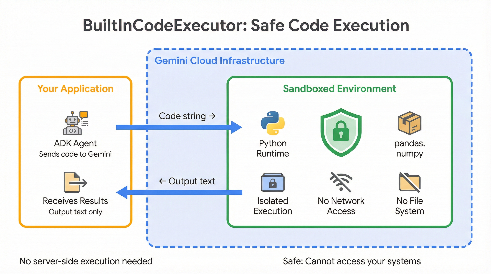
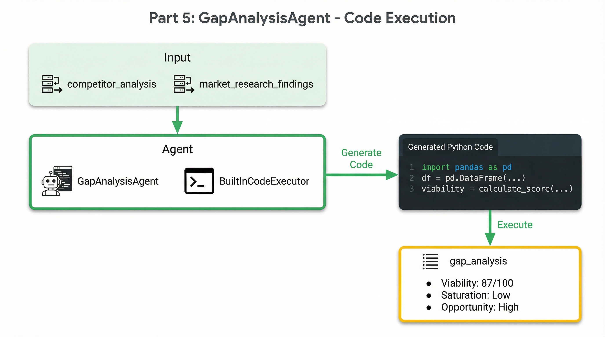

# Part 5: Quantitative Analysis with Code Execution

In the previous parts, you built agents that gather qualitative intelligence—market research from web searches and competitor data from Google Maps. But now comes the hard part: synthesizing all this information into actionable recommendations. Which zone has the best viability? How saturated is the market? What's the optimal trade-off between competition density and foot traffic?

These questions require precise calculations, and that's where LLMs struggle. Ask a model to compute a weighted average across 15 data points, and it might hallucinate results. The solution is to have the model **write code** that computes exactly.

<p align="center">
  
</p>

---

## When LLMs Need to Calculate

Large language models excel at reasoning, pattern recognition, and generating human-like text. But they have a fundamental weakness: arithmetic precision. Even simple calculations can go wrong when the model "thinks through" them rather than computing them.

Consider the analysis our agent needs to perform. We have 15 competitors across 5 zones, each with ratings, review counts, and business classifications. We need to calculate:

- **Saturation indices** based on competitor density and quality
- **Viability scores** using weighted multi-factor formulas
- **Zone rankings** that account for chain dominance, infrastructure, and costs

Asking the LLM to reason through these calculations leads to errors. A better approach: have the model write Python code that executes these calculations precisely. The model's strength—understanding what to compute—combines with code's strength—computing it accurately.

<p align="center">
  
</p>

---

## BuiltInCodeExecutor: Safe, Sandboxed Execution

ADK provides `BuiltInCodeExecutor` for Gemini's native code execution capability. This is remarkably different from traditional approaches where you'd need to set up a code sandbox, manage execution environments, and handle security concerns.

```python
from google.adk.code_executors import BuiltInCodeExecutor

gap_analysis_agent = LlmAgent(
    # ...
    code_executor=BuiltInCodeExecutor(),
)
```

When you add a code executor to an agent, something interesting happens. The agent gains the ability to write Python code, have Gemini execute it in a sandboxed environment, capture the output, and then interpret the results. All of this happens within Gemini's infrastructure—no server-side execution needed on your end.

The sandbox is secure by design. The executed code can't access your file system, can't make network requests, and can't escape its isolated environment. It has access to standard Python libraries like `pandas` and `numpy`, which is exactly what we need for data analysis.

> **Learn more:** The [Code Execution documentation](https://google.github.io/adk-docs/tools/code-execution/) covers executor types and configuration options.

---

## The Analysis Instruction

The instruction prompt is where we define what the agent should calculate and how. This is a longer instruction than our previous agents because we're essentially writing a specification for the code the agent will generate.

```python
GAP_ANALYSIS_INSTRUCTION = """You are a data scientist analyzing market opportunities using quantitative methods.

Your task is to perform advanced gap analysis on the data collected from previous stages.

TARGET LOCATION: {target_location}
BUSINESS TYPE: {business_type}
CURRENT DATE: {current_date}

## Available Data

### MARKET RESEARCH FINDINGS (Part 1):
{market_research_findings}

### COMPETITOR ANALYSIS (Part 2):
{competitor_analysis}

## Your Mission
Write and execute Python code to perform comprehensive quantitative analysis.

## Analysis Steps

### Step 1: Parse Competitor Data
Extract from the competitor analysis:
- Competitor names and locations
- Ratings and review counts
- Zone/area classifications
- Business types (chain vs independent)

### Step 2: Calculate Zone Metrics
For each identified zone, compute:

**Basic Metrics:**
- Competitor count
- Competitor density (per estimated area)
- Average competitor rating
- Total review volume

**Opportunity Metrics:**
- Demand Signal: Based on population, income, infrastructure
- Market Saturation Index: (Competitors × Quality) / Demand
- Viability Score: Multi-factor weighted score

### Step 3: Zone Categorization
Classify each zone as:
- **SATURATED**: High competition, low opportunity
- **MODERATE**: Balanced market, moderate opportunity
- **OPPORTUNITY**: Low competition, high potential

### Step 4: Rank Top Zones
Create a weighted ranking considering:
- Low market saturation (weight: 30%)
- High demand signals (weight: 30%)
- Low chain dominance (weight: 15%)
- Infrastructure quality (weight: 15%)
- Manageable costs (weight: 10%)

## Code Guidelines
- Use pandas for data manipulation
- Print all results clearly formatted
- Include intermediate calculations for transparency
- Handle missing data gracefully

Execute the code and provide actionable strategic recommendations.
"""
```

Several aspects of this instruction are worth noting. First, it provides all previous data via state injection—`{market_research_findings}` and `{competitor_analysis}` pull in the outputs from earlier pipeline stages. Second, it specifies exact calculations with explicit weightings, giving the model a clear formula to implement. Finally, it requests pandas for data manipulation, which is available in the sandbox environment.

---

## Building the GapAnalysisAgent

With the instruction defined, the agent definition is straightforward:

```python
# app/sub_agents/gap_analysis/agent.py
from google.adk.agents import LlmAgent
from google.adk.code_executors import BuiltInCodeExecutor
from google.genai import types

from ...config import CODE_EXEC_MODEL, RETRY_INITIAL_DELAY, RETRY_ATTEMPTS
from ...callbacks import before_gap_analysis, after_gap_analysis

gap_analysis_agent = LlmAgent(
    name="GapAnalysisAgent",
    model=CODE_EXEC_MODEL,
    description="Performs quantitative gap analysis using Python code execution for zone rankings and viability scores",
    instruction=GAP_ANALYSIS_INSTRUCTION,
    generate_content_config=types.GenerateContentConfig(
        http_options=types.HttpOptions(
            retry_options=types.HttpRetryOptions(
                initial_delay=RETRY_INITIAL_DELAY,
                attempts=RETRY_ATTEMPTS,
            ),
        ),
    ),
    code_executor=BuiltInCodeExecutor(),
    output_key="gap_analysis",
    before_agent_callback=before_gap_analysis,
    after_agent_callback=after_gap_analysis,
)
```

The key parameters here:

| Parameter | Value | Purpose |
|-----------|-------|---------|
| `model` | `CODE_EXEC_MODEL` | Model optimized for code generation |
| `code_executor` | `BuiltInCodeExecutor()` | Enables sandboxed code execution |
| `output_key` | `"gap_analysis"` | Saves analysis results for downstream agents |

We use `CODE_EXEC_MODEL` from our config because some models are better at generating reliable, executable code. The model needs to understand not just what to calculate, but how to write syntactically correct Python that handles edge cases.

> **Learn more:** The [BuiltInCodeExecutor reference](https://google.github.io/adk-docs/tools/code-execution/#built-in-code-executor) covers advanced configuration.

---

## Extracting Executed Code for Transparency

One of the challenges with code execution is visibility. The agent writes code, Gemini executes it, and we see the results—but what exactly was executed? For debugging, reproducibility, and transparency, we want to extract and save the Python code.

The after callback handles this extraction:

```python
# app/callbacks/pipeline_callbacks.py
def after_gap_analysis(callback_context: CallbackContext) -> Optional[types.Content]:
    """Log completion of gap analysis and extract executed Python code."""
    gap = callback_context.state.get("gap_analysis", "")
    gap_len = len(gap) if isinstance(gap, str) else 0

    logger.info(f"STAGE 2B: COMPLETE - Gap analysis: {gap_len} characters")

    # Extract Python code from the gap_analysis content first
    extracted_code = _extract_python_code_from_content(gap)

    # Try to extract from invocation context (BuiltInCodeExecutor uses executable_code parts)
    if not extracted_code:
        extracted_code = _extract_code_from_invocation(callback_context)

    if extracted_code:
        callback_context.state["gap_analysis_code"] = extracted_code
        logger.info(f"  Extracted Python code: {len(extracted_code)} characters")

    stages = callback_context.state.get("stages_completed", [])
    stages.append("gap_analysis")
    callback_context.state["stages_completed"] = stages

    return None
```

Having `gap_analysis_code` in state serves multiple purposes. During development, you can see exactly what was executed when debugging unexpected results. For production systems, you can log the code for audit trails. And if you want to show users the methodology, the extracted code provides complete transparency into how scores were calculated.

### The Extraction Helpers

The extraction process tries two approaches. First, it looks for Python code blocks in the markdown output:

```python
def _extract_python_code_from_content(content: str) -> str:
    """Extract Python code blocks from markdown content."""
    import re

    if not content:
        return ""

    # Match fenced code blocks with python language specifier
    code_blocks = []
    pattern = r'```(?:python|py)\s*\n(.*?)```'
    matches = re.findall(pattern, content, re.DOTALL | re.IGNORECASE)

    for match in matches:
        code = match.strip()
        if code:
            code_blocks.append(code)

    return "\n\n# ---\n\n".join(code_blocks)
```

If that doesn't find code, it looks in the invocation context for `executable_code` parts, which is how Gemini's native code execution stores the code that was run.

---

## What the Agent Actually Produces

Let's look at a real example. Given competitor data from the previous stage, the GapAnalysisAgent might write and execute code like this:

```python
import pandas as pd

# Parse competitor data into DataFrame
competitors = [
    {"name": "Third Wave Coffee", "zone": "100 Feet Road", "rating": 4.5, "reviews": 2847, "is_chain": True},
    {"name": "Blue Tokai", "zone": "100 Feet Road", "rating": 4.6, "reviews": 987, "is_chain": True},
    {"name": "Dyu Art Cafe", "zone": "12th Main", "rating": 4.4, "reviews": 3241, "is_chain": False},
    # ... more competitors
]

df = pd.DataFrame(competitors)

# Calculate zone metrics
zone_metrics = df.groupby('zone').agg({
    'name': 'count',
    'rating': 'mean',
    'reviews': 'sum',
    'is_chain': 'mean'
}).rename(columns={
    'name': 'competitor_count',
    'rating': 'avg_rating',
    'reviews': 'total_reviews',
    'is_chain': 'chain_ratio'
})

# Calculate saturation index
zone_metrics['saturation_index'] = (
    zone_metrics['competitor_count'] * zone_metrics['avg_rating']
) / 10

# Calculate viability score (higher is better)
zone_metrics['viability_score'] = (
    (1 - zone_metrics['saturation_index'] / zone_metrics['saturation_index'].max()) * 0.4 +
    (1 - zone_metrics['chain_ratio']) * 0.3 +
    (zone_metrics['avg_rating'] / 5) * 0.3
) * 100

# Rank zones
zone_metrics = zone_metrics.sort_values('viability_score', ascending=False)

print("Zone Analysis Results:")
print(zone_metrics.round(2))
print("\nTop Recommended Zone:", zone_metrics.index[0])
print("Viability Score:", round(zone_metrics['viability_score'].iloc[0], 1))
```

The execution output:

```
Zone Analysis Results:
                    competitor_count  avg_rating  total_reviews  chain_ratio  saturation_index  viability_score
zone
Defence Colony                     2        4.25           412         0.00              0.85            78.5
12th Main                          4        4.35          4521         0.25              1.74            65.2
100 Feet Road                      6        4.50          6847         0.67              2.70            52.1

Top Recommended Zone: Defence Colony
Viability Score: 78.5
```

This is precise, reproducible analysis. Defence Colony ranks highest because it has low competition (only 2 competitors), no chain dominance (0% chain ratio), and good average ratings. The 100 Feet Road zone, despite having highly-rated establishments, scores lowest due to saturation (6 competitors, 67% chains).

---

## Testing the GapAnalysisAgent

Start the development server and run through a complete analysis:

```bash
make dev
```

Open `http://localhost:8501` and enter a query like:

> "I want to open a coffee shop in Indiranagar, Bangalore"

Watch the pipeline progress through market research, competitor mapping, and then gap analysis. In the output, you'll see the Python code being executed and the resulting DataFrames with zone metrics.

In the **State** panel, look for:
- `gap_analysis` — The full analysis output including interpretation
- `gap_analysis_code` — The raw Python code that was executed

The code extraction is particularly useful for debugging. If a viability score seems off, you can see exactly how it was calculated.

---

## What You've Learned

In this part, you've seen how ADK enables agents to combine reasoning with computation:

- **BuiltInCodeExecutor** provides sandboxed Python execution within Gemini's infrastructure
- **Detailed instructions** guide the model to write reliable, structured code
- **Code extraction** in callbacks enables debugging and transparency
- **State injection** passes upstream data into the code generation context
- **Pandas** and other libraries are available in the sandbox for data manipulation

This pattern—having the LLM write code rather than perform calculations directly—is powerful for any task requiring precision: financial analysis, statistical modeling, data transformation, or complex business logic.

---

## Quick Reference

| Feature | How to Use |
|---------|------------|
| Enable code execution | `code_executor=BuiltInCodeExecutor()` |
| Code-optimized model | Use `CODE_EXEC_MODEL` from config |
| Access executed code | Extract from callback context |
| State injection | Use `{market_research_findings}` in instruction |
| Available libraries | pandas, numpy, standard Python |

**Files referenced in this part:**

- [`app/sub_agents/gap_analysis/agent.py`](../app/sub_agents/gap_analysis/agent.py) — GapAnalysisAgent definition
- [`app/callbacks/pipeline_callbacks.py`](../app/callbacks/pipeline_callbacks.py) — Code extraction callbacks
- [`app/config.py`](../app/config.py) — Model configuration including CODE_EXEC_MODEL

**ADK Documentation:**

- [Code Execution](https://google.github.io/adk-docs/tools/code-execution/) — Overview of code execution in ADK
- [BuiltInCodeExecutor](https://google.github.io/adk-docs/tools/code-execution/#built-in-code-executor) — Gemini's native code executor
- [Session State](https://google.github.io/adk-docs/sessions/state/) — How state flows between agents

---

## Next: Strategy Synthesis with Extended Thinking

We now have quantitative data—viability scores, saturation indices, and zone rankings. But numbers alone don't make decisions. How do we weigh a zone with 78% viability but higher rent against one with 65% viability but prime foot traffic? What if the "best" zone has no available retail space?

Strategic decisions require nuanced reasoning that considers trade-offs, constraints, and business context. In **[Part 6: Strategy Synthesis](./06-strategy-synthesis.md)**, you'll build the StrategyAdvisorAgent that uses Gemini's **extended thinking** capability. This agent doesn't just summarize—it thinks through trade-offs before responding, producing consultant-grade strategic recommendations.

You'll learn:
- Using **ThinkingConfig** for "think before responding" behavior
- Designing complex **Pydantic schemas** for structured reports
- Saving JSON artifacts in callbacks for downstream processing
- When extended thinking adds value vs. standard generation

---

**[← Back to Part 4: Competitor Mapping](./04-competitor-mapping.md)** | **[Continue to Part 6: Strategy Synthesis →](./06-strategy-synthesis.md)**
