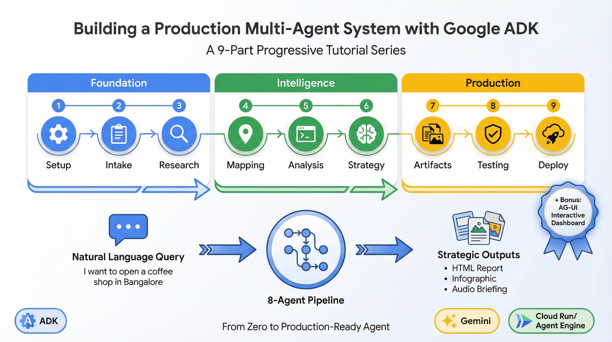

# Building a Production Multi-Agent System with Google ADK

A progressive tutorial series where you build the **Retail AI Location Strategy Agent** step-by-step. Each part adds a new capability, and by the end of each part, you have a working agent you can run.

<p align="center">
  
</p>

## The Agent You'll Build

An 8-agent pipeline that transforms a simple question—*"Where should I open a coffee shop?"*—into comprehensive market intelligence with strategic reports, visual infographics, and podcast-style audio briefings.

**Input**: Natural language request like *"I want to open a coffee shop in Indiranagar, Bangalore"*

**Output**:
- Structured strategic report with evidence-backed recommendations
- McKinsey/BCG-style HTML executive presentation
- Visual infographic summarizing key findings
- Audio podcast briefing for on-the-go consumption

## The Series

| Part | Title | What You Build | Key ADK Concepts |
|------|-------|----------------|------------------|
| [1](./01-setup-first-agent.md) | Setup & First Agent | Project structure, root agent | `root_agent` export, ADK Web UI |
| [2](./02-intake-agent.md) | Request Parsing | IntakeAgent | Pydantic schemas, `output_key`, structured output |
| [3](./03-market-research.md) | Market Research | MarketResearchAgent | Built-in tools, `google_search`, state injection |
| [4](./04-competitor-mapping.md) | Competitor Mapping | CompetitorMappingAgent | Custom tools, `ToolContext`, API integration |
| [5](./05-code-execution.md) | Quantitative Analysis | GapAnalysisAgent | `BuiltInCodeExecutor`, pandas, code extraction |
| [6](./06-strategy-synthesis.md) | Strategic Synthesis | StrategyAdvisorAgent | `ThinkingConfig`, extended reasoning, artifacts |
| [7](./07-artifact-generation.md) | Multimodal Output | ArtifactGenerationPipeline | `ParallelAgent`, image/audio generation |
| [8](./08-testing.md) | Testing & Evaluation | Test suite | Integration tests, ADK evaluations |
| [9](./09-production-deployment.md) | Production Deployment | Cloud Run, Agent Engine | Deployment, IAP, secrets management |
| [Bonus](./bonus-ag-ui-frontend.md) | AG-UI Frontend | Interactive dashboard | AG-UI Protocol, CopilotKit, real-time state |

## Architecture

The pipeline uses a `SequentialAgent` to orchestrate five analysis stages, followed by a `ParallelAgent` that generates three output artifacts concurrently:

**Sequential Analysis Pipeline:**
1. **IntakeAgent** — Parses natural language into structured data
2. **MarketResearchAgent** — Searches the web for demographics, trends, and market insights
3. **CompetitorMappingAgent** — Finds real competitors via Google Maps Places API
4. **GapAnalysisAgent** — Calculates viability scores using sandboxed Python code
5. **StrategyAdvisorAgent** — Synthesizes findings into strategic recommendations

**Parallel Artifact Generation:**
- **ReportGeneratorAgent** — Creates McKinsey-style HTML presentations
- **InfographicGeneratorAgent** — Generates visual infographics with Gemini
- **AudioOverviewAgent** — Produces podcast-style audio briefings with multi-speaker TTS

## Prerequisites

Before starting, you should:
- Know Python basics
- Have familiarity with [Google ADK](https://google.github.io/adk-docs/) concepts (agents, tools, state)
- Have API keys ready (Google AI Studio or Vertex AI, Google Maps)

This tutorial assumes you know ADK fundamentals. For deeper concepts, each part links to the [official ADK documentation](https://google.github.io/adk-docs/).

## Quick Start

To see the complete agent before building it yourself:

```bash
git clone https://github.com/anthropics/build-with-adk.git
cd build-with-adk/retail-ai-location-strategy

# Configure environment
echo "GOOGLE_GENAI_USE_VERTEXAI=FALSE" >> app/.env
echo "GOOGLE_API_KEY=your_key" >> app/.env
echo "MAPS_API_KEY=your_maps_key" >> app/.env

# Install and run
make install && make dev
```

Open `http://localhost:8501` and try: *"I want to open a coffee shop in Indiranagar, Bangalore"*

## What You'll Learn

By completing this series, you'll understand how to:

1. **Structure multi-agent pipelines** with `SequentialAgent` and `ParallelAgent`
2. **Parse unstructured input** into structured data with Pydantic schemas
3. **Integrate external APIs** with custom tools and `ToolContext`
4. **Execute code dynamically** with `BuiltInCodeExecutor` for quantitative analysis
5. **Use extended reasoning** with `ThinkingConfig` for complex synthesis
6. **Generate multimodal outputs** including HTML, images, and audio
7. **Test AI agents** with unit tests, integration tests, and ADK evaluations
8. **Deploy to production** with Cloud Run, IAP authentication, and Agent Starter Pack

## Start Building

Ready? Begin with **[Part 1: Setup and Your First Agent](./01-setup-first-agent.md)**.

---

**Authors**: [Lavi Nigam](https://github.com/lavinigam-gcp) and [Deepak Moonat](https://github.com/dmoonat)

**Source Code**: [retail-ai-location-strategy](../)

**ADK Documentation**: [google.github.io/adk-docs](https://google.github.io/adk-docs/)
