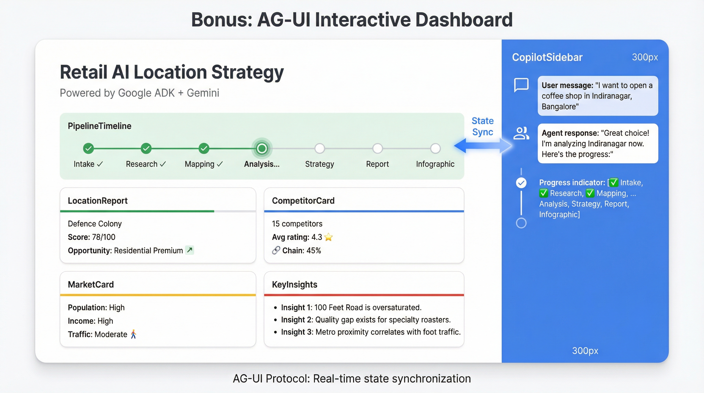

# Bonus: AG-UI Interactive Dashboard

The ADK Web UI at `localhost:8501` works great for development, but what if you want something richer? A polished dashboard where stakeholders can watch the pipeline unfold in real-time, see competitor data rendered as interactive cards, and explore strategic recommendations without understanding the technical details?

This bonus part shows you how to build exactly that—a Next.js frontend that connects to your agent using the AG-UI Protocol. The result is a professional dashboard with real-time progress visualization, generative UI components, and bidirectional state synchronization between your agent and the browser.

<p align="center">
  
</p>

---

## Beyond ADK Web

The ADK Web UI is designed for developers. It shows raw state, tool calls, and agent traces—everything you need to debug and iterate. But for stakeholder demos and end-user experiences, you might want:

| Capability | Why It Matters |
|------------|----------------|
| **Real-time progress visualization** | Watch each pipeline stage complete with visual feedback |
| **Generative UI** | Rich cards and charts that appear inline in the chat |
| **Interactive dashboards** | Location scores, competitor stats, and market cards |
| **Bidirectional state sync** | Frontend and agent share state automatically |

The [AG-UI Protocol](https://docs.ag-ui.com/) combined with [CopilotKit](https://docs.copilotkit.ai/) provides exactly this. The protocol defines how frontends communicate with AI agents, while CopilotKit provides React hooks that make integration straightforward.

---

## How It Works

The architecture is simple. Your existing ADK agent stays exactly as you built it in Parts 1-7. A thin FastAPI layer wraps the agent with AG-UI protocol support. The Next.js frontend connects to this layer and receives real-time state updates via Server-Sent Events (SSE).

The key insight is that your callbacks from earlier parts—the ones that set `pipeline_stage` and `stages_completed`—are already doing the work. The frontend just reads that state and renders it beautifully.

---

## Quick Start

The project includes Makefile targets that handle the entire setup:

```bash
# First time: Install dependencies for both backend and frontend
make ag-ui-install

# Start both servers
make ag-ui
```

This runs two servers concurrently:
- **Backend** at `http://localhost:8000` — FastAPI server with AG-UI middleware
- **Frontend** at `http://localhost:3000` — Next.js dashboard with CopilotKit

Open `http://localhost:3000`, type a query like "I want to open a coffee shop in Indiranagar, Bangalore," and watch the dashboard come alive as your agent works through each stage.

---

## The Backend Wrapper

The backend is remarkably minimal. It wraps your existing agent without requiring any modifications to the agent code itself:

```python
# app/frontend/backend/main.py
from ag_ui_adk import ADKAgent, add_adk_fastapi_endpoint
from app.agent import root_agent  # Your existing agent!

# Wrap the existing ADK agent with AG-UI middleware
adk_agent = ADKAgent(
    adk_agent=root_agent,
    app_name="retail_location_strategy",
    user_id="demo_user",
    execution_timeout_seconds=1800,  # 30 min for full pipeline
    tool_timeout_seconds=600,  # 10 min for individual tools
)

app = FastAPI(
    title="Retail Location Strategy API",
    description="AG-UI compatible API for the Retail AI Location Strategy agent",
)

# CORS for frontend
app.add_middleware(
    CORSMiddleware,
    allow_origins=["http://localhost:3000"],
    allow_credentials=True,
    allow_methods=["*"],
    allow_headers=["*"],
)

# Add AG-UI endpoint - handles all protocol communication
add_adk_fastapi_endpoint(app, adk_agent, path="/")
```

The critical line is `from app.agent import root_agent`—it imports your exact same agent. The `ADKAgent` wrapper adds AG-UI protocol support, translating the agent's state changes into SSE events that the frontend can consume. No changes to your carefully crafted prompts, tools, or callbacks.

---

## The Frontend Page

The main page connects to the agent and renders its state. CopilotKit provides two key hooks that make this work:

```tsx
// app/frontend/app/page.tsx
"use client";

import { CopilotSidebar } from "@copilotkit/react-ui";
import { useCoAgent, useCoAgentStateRender } from "@copilotkit/react-core";
import { PipelineTimeline } from "@/components/PipelineTimeline";
import { LocationReport } from "@/components/LocationReport";
import { CompetitorCard } from "@/components/CompetitorCard";
import { MarketCard } from "@/components/MarketCard";
import type { AgentState } from "@/lib/types";

export default function Home() {
  // Connect to agent state - receives STATE_SNAPSHOT and STATE_DELTA events
  const { state } = useCoAgent<AgentState>({
    name: "retail_location_strategy",  // Must match backend app_name
  });

  // Render state in chat as generative UI
  useCoAgentStateRender<AgentState>({
    name: "retail_location_strategy",
    render: ({ state }) => {
      if (!state) return null;

      const stageLabels: Record<string, string> = {
        market_research: "Researching market trends...",
        competitor_mapping: "Mapping competitors...",
        gap_analysis: "Analyzing market gaps...",
        strategy_synthesis: "Synthesizing strategy...",
        report_generation: "Generating executive report...",
      };

      const currentLabel = stageLabels[state.pipeline_stage] || "Processing...";
      const completedCount = state.stages_completed?.length || 0;

      return (
        <div className="p-3 bg-gray-50 rounded-lg border border-gray-100">
          <div className="flex items-center justify-between">
            <div className="flex items-center gap-2">
              <span className="w-2 h-2 bg-amber-500 rounded-full animate-pulse" />
              <span className="text-gray-700 text-sm">{currentLabel}</span>
            </div>
            <span className="text-xs text-gray-500">
              {completedCount}/7 complete
            </span>
          </div>
        </div>
      );
    },
  });

  return (
    <CopilotSidebar defaultOpen={true} clickOutsideToClose={false}>
      <main className="min-h-screen bg-gradient-to-br from-slate-50 to-blue-50">
        {/* Pipeline Timeline - shown when analysis is in progress */}
        {state?.target_location && (
          <PipelineTimeline
            state={state}
            currentStage={state.pipeline_stage}
            completedStages={state.stages_completed || []}
          />
        )}

        {/* Detailed Report Cards - shown when complete */}
        {state?.strategic_report && (
          <div className="space-y-6">
            <LocationReport report={state.strategic_report} />
            <div className="grid md:grid-cols-2 gap-6">
              <CompetitorCard competition={state.strategic_report.top_recommendation.competition} />
              <MarketCard market={state.strategic_report.top_recommendation.market} />
            </div>
          </div>
        )}
      </main>
    </CopilotSidebar>
  );
}
```

The `useCoAgent` hook connects to the agent and receives state updates via SSE. The `useCoAgentStateRender` hook renders custom UI inline in the chat sidebar—this is what creates the "generative UI" effect where rich components appear as the agent works.

> **Learn more:** The [CopilotKit documentation](https://docs.copilotkit.ai/) covers all available hooks and configuration options.

---

## State Synchronization

Here's where the design decisions from earlier parts pay off. Throughout Parts 2-7, you built callbacks that set state values like `pipeline_stage` and `stages_completed`. The AG-UI frontend reads exactly those values.

| State Field | Set By | Used In Frontend |
|-------------|--------|------------------|
| `pipeline_stage` | `before_*` callbacks | PipelineTimeline current stage |
| `stages_completed` | `after_*` callbacks | PipelineTimeline completed stages |
| `target_location` | IntakeAgent `output_key` | Header card |
| `business_type` | IntakeAgent `output_key` | Header card |
| `market_research_findings` | MarketResearchAgent `output_key` | ScrollableMarkdown |
| `competitor_analysis` | CompetitorMappingAgent `output_key` | CompetitorCard |
| `gap_analysis` | GapAnalysisAgent `output_key` | TabbedGapAnalysis |
| `strategic_report` | StrategyAdvisorAgent `output_key` | LocationReport |

This is the payoff of the callback pattern. Every `before_agent_callback` sets `pipeline_stage` so the timeline knows what's currently running. Every `after_agent_callback` appends to `stages_completed` so the timeline knows what's done. The `output_key` on each agent automatically populates state fields that the frontend reads.

```python
# Example from app/callbacks/pipeline_callbacks.py
def before_market_research(callback_context: CallbackContext):
    callback_context.state["pipeline_stage"] = "market_research"  # Frontend reads this
    callback_context.state["current_date"] = datetime.now().strftime("%Y-%m-%d")
    return None

def after_market_research(callback_context: CallbackContext):
    stages = callback_context.state.get("stages_completed", [])
    stages.append("market_research")  # Frontend reads this
    callback_context.state["stages_completed"] = stages
    return None
```

Your callbacks in `app/callbacks/pipeline_callbacks.py` already set these state values—the frontend just reads them.

---

## Project Structure

The frontend code lives in `app/frontend/`, keeping it separate from the core agent code:

```
app/frontend/
├── backend/
│   ├── main.py              # FastAPI + ADKAgent wrapper
│   └── requirements.txt     # Python dependencies
│
├── app/
│   ├── layout.tsx           # CopilotKit provider
│   ├── page.tsx             # Main page with sidebar
│   └── globals.css          # Tailwind styles
│
├── components/
│   ├── PipelineTimeline.tsx     # Collapsible steps with progress
│   ├── CollapsibleStep.tsx      # Individual pipeline step
│   ├── StepOutputContent.tsx    # Stage-specific renderers
│   ├── ScrollableMarkdown.tsx   # Scrollable markdown container
│   ├── TabbedGapAnalysis.tsx    # Results + Code tabs
│   ├── LocationReport.tsx       # Top recommendation card
│   ├── CompetitorCard.tsx       # Competition statistics
│   ├── MarketCard.tsx           # Market characteristics
│   ├── AlternativeLocations.tsx # Alternative options
│   └── ArtifactViewer.tsx       # HTML report & infographic
│
├── lib/
│   ├── types.ts             # TypeScript types (matches Pydantic)
│   └── summaryHelpers.ts    # Summary extraction functions
│
├── package.json
└── tailwind.config.js
```

---

## Frontend Components

### PipelineTimeline

The timeline shows the 7-stage pipeline with collapsible steps. Each step displays its status (pending, running, complete) and can be expanded to show the output:

```tsx
// app/frontend/components/PipelineTimeline.tsx
const stages = [
  { id: "intake", label: "Request Parsing", icon: "📝" },
  { id: "market_research", label: "Market Research", icon: "🔍" },
  { id: "competitor_mapping", label: "Competitor Mapping", icon: "📍" },
  { id: "gap_analysis", label: "Gap Analysis", icon: "📊" },
  { id: "strategy_synthesis", label: "Strategy Synthesis", icon: "🧠" },
  { id: "report_generation", label: "Report Generation", icon: "📄" },
  { id: "infographic_generation", label: "Infographic", icon: "🎨" },
];
```

### LocationReport

This component displays the top recommendation from `strategic_report` with a visual score and key details:

```tsx
// app/frontend/components/LocationReport.tsx
export function LocationReport({ report }: { report: LocationIntelligenceReport }) {
  const rec = report.top_recommendation;

  return (
    <div className="bg-white rounded-xl shadow-sm border p-6">
      <div className="flex justify-between items-start mb-4">
        <div>
          <h2 className="text-2xl font-bold text-gray-900">{rec.location_name}</h2>
          <p className="text-gray-600">{rec.area}</p>
        </div>
        <div className="text-3xl font-bold text-green-600">
          {rec.overall_score}/100
        </div>
      </div>
      {/* Strengths, Concerns, Next Steps... */}
    </div>
  );
}
```

---

## Manual Setup

If you prefer to set things up manually rather than using the Makefile:

### Backend

```bash
cd app/frontend/backend
pip install -r requirements.txt
python main.py
# Server runs at http://localhost:8000
```

### Frontend

```bash
cd app/frontend
npm install
cp .env.local.example .env.local
npm run dev
# App runs at http://localhost:3000
```

---

## Environment Variables

The backend uses your existing `app/.env` file. The frontend needs its own configuration:

**Backend (`app/.env`)**

```bash
GOOGLE_API_KEY=your_google_api_key
MAPS_API_KEY=your_google_maps_api_key
GOOGLE_GENAI_USE_VERTEXAI=FALSE
```

**Frontend (`app/frontend/.env.local`)**

```bash
NEXT_PUBLIC_BACKEND_URL=http://localhost:8000
```

---

## Demo Walkthrough

1. **Open http://localhost:3000** — The CopilotSidebar opens on the right, and the main dashboard area shows a welcome state.

2. **Type a query in the chat** — "I want to open a coffee shop in Indiranagar, Bangalore"

3. **Watch the pipeline unfold** — A progress indicator appears in the chat. The PipelineTimeline shows each stage completing. Collapsible steps reveal stage outputs as they become available.

4. **View the results** — When complete, you'll see the LocationReport card with score and recommendation, CompetitorCard with competition stats, MarketCard with market characteristics, and an ArtifactViewer for the HTML report and infographic.

---

## Troubleshooting

### Backend won't start

1. Ensure you're in the correct directory: `app/frontend/backend`
2. Check that `app/.env` file exists with API keys
3. Verify `ag-ui-adk` is installed: `pip install ag-ui-adk`

### Frontend shows "Connection Error"

1. Ensure backend is running at http://localhost:8000
2. Check CORS settings in `backend/main.py`
3. Verify `NEXT_PUBLIC_BACKEND_URL` in `.env.local`

### State not updating

1. Check browser console for WebSocket/SSE errors
2. Verify agent name matches: `"retail_location_strategy"`
3. Ensure callbacks in `pipeline_callbacks.py` are setting state correctly

---

## Adding New Components

To add a new UI component that responds to agent state:

1. **Add TypeScript interface** to `lib/types.ts` matching your Pydantic schema
2. **Create component** in `components/` that renders the state
3. **Import in `app/page.tsx`** and conditionally render based on state
4. **Optionally add to `useCoAgentStateRender`** for display in the chat sidebar

---

## What You've Learned

In this bonus part, you've connected a rich frontend to your ADK agent:

- **AG-UI Protocol** provides the communication layer between frontend and agent
- **CopilotKit hooks** (`useCoAgent`, `useCoAgentStateRender`) make React integration simple
- **ADKAgent wrapper** adds protocol support without modifying your agent code
- **State synchronization** leverages the callbacks you built in earlier parts
- **Generative UI** creates dynamic components that appear as the agent works

The key insight is that the work you did in Parts 2-7—setting state in callbacks, using `output_key` to save results—directly enables this rich frontend experience.

---

## Quick Reference

| Command | Description |
|---------|-------------|
| `make ag-ui-install` | Install backend + frontend dependencies |
| `make ag-ui` | Start both servers (8000 + 3000) |

| Hook | Purpose |
|------|---------|
| `useCoAgent` | Connect to agent state, receive updates |
| `useCoAgentStateRender` | Render custom UI inline in chat |

**Files referenced in this part:**

- [`app/frontend/README.md`](../app/frontend/README.md) — Full frontend documentation
- [`app/frontend/backend/main.py`](../app/frontend/backend/main.py) — FastAPI wrapper
- [`app/frontend/app/page.tsx`](../app/frontend/app/page.tsx) — Main page
- [`app/frontend/components/`](../app/frontend/components/) — UI components

**External Documentation:**

- [AG-UI Protocol](https://docs.ag-ui.com/) — Protocol specification
- [CopilotKit](https://docs.copilotkit.ai/) — React hooks and components

---

**[← Back to Part 9: Production Deployment](./09-production-deployment.md)** | **[Return to Series Overview →](./README.md)**
