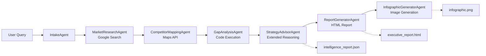

# Retail AI Location Strategy with Google ADK

A multi-agent AI pipeline for retail site selection, built with [Google Agent Development Kit (ADK)](https://google.github.io/adk-docs/) and Gemini.

## What It Does

Given a location and business type, this pipeline automatically:

- Researches the market using live web search
- Maps competitors using Google Maps Places API
- Calculates viability scores with Python code execution
- Generates strategic recommendations with extended reasoning
- Produces an HTML executive report and visual infographic

---

## Quick Start

### Prerequisites

- Python 3.10+
- [uv](https://docs.astral.sh/uv/) (recommended) or pip
- [Google Maps API key](https://console.cloud.google.com/apis/credentials) (with Places API enabled)

**Choose ONE authentication method:**
- **Option A:** [Google AI Studio API key](https://aistudio.google.com/app/apikey) (default, for local development)
- **Option B:** Google Cloud Project with Vertex AI API enabled (for production)

---

## Getting Started

### 1. Clone and Navigate

```bash
git clone https://github.com/lavinigam-gcp/build-with-adk.git
cd build-with-adk/retail_ai_location_strategy_adk
```

### 2. Set Up Environment Variables

#### Option A: Google AI Studio (Default - Recommended for Local Development)

```bash
cp .env.example .env
# Edit .env with your keys:
#   GOOGLE_API_KEY=your_ai_studio_key
#   GOOGLE_GENAI_USE_VERTEXAI=FALSE
#   MAPS_API_KEY=your_maps_key
```

Or set them directly:
```bash
echo "GOOGLE_GENAI_USE_VERTEXAI=FALSE" >> .env
echo "GOOGLE_API_KEY=YOUR_AI_STUDIO_API_KEY" >> .env
echo "MAPS_API_KEY=YOUR_MAPS_API_KEY" >> .env
```

#### Option B: Google Cloud Vertex AI (For Production/Deployment)

```bash
# Authenticate with Google Cloud
gcloud auth application-default login

# Set environment variables
echo "GOOGLE_GENAI_USE_VERTEXAI=TRUE" >> .env
echo "GOOGLE_CLOUD_PROJECT=your-project-id" >> .env
echo "GOOGLE_CLOUD_LOCATION=us-central1" >> .env
echo "MAPS_API_KEY=YOUR_MAPS_API_KEY" >> .env
```

### 3. Install and Run

```bash
make install && make dev
```

This will:
1. Install all dependencies using `uv`
2. Start the ADK web UI at `http://localhost:8000`

Open `http://localhost:8000`, select **retail_ai_location_strategy_adk** from the dropdown, and try one of the examples below.

---

## Makefile Commands

| Command | Description |
|---------|-------------|
| `make install` | Install dependencies with uv |
| `make dev` | Run agent locally with ADK web UI |
| `make playground` | Alias for `make dev` |
| `make backend` | Deploy to Vertex AI Agent Engine |
| `make deploy-cloud-run` | Deploy to Cloud Run |
| `make test` | Run tests |
| `make clean` | Clean build artifacts |
| `make help` | Show all available commands |

---

## Deployment

### Deploy to Vertex AI Agent Engine

1. Set up Google Cloud:
```bash
gcloud auth application-default login
gcloud config set project YOUR_PROJECT_ID
```

2. Deploy:
```bash
make backend
```

### Deploy to Cloud Run

```bash
export GOOGLE_CLOUD_PROJECT=your-project-id
export GOOGLE_CLOUD_LOCATION=us-central1
make deploy-cloud-run
```

---

## Interactive UI (Optional)

For a richer experience with real-time pipeline visualization:

```bash
# Terminal 1: Start the backend
cd frontend/backend
pip install -r requirements.txt
python main.py
# Runs at http://localhost:8000

# Terminal 2: Start the frontend
cd frontend
npm install --legacy-peer-deps
cp .env.local.example .env.local
npm run dev
# Runs at http://localhost:3000
```

Open `http://localhost:3000` to see the interactive dashboard with collapsible pipeline steps, live progress tracking, and downloadable reports.

See [frontend/README.md](frontend/README.md) for detailed frontend documentation.

---

## Example Prompts

| Region | Location | Business | Example Prompt |
|--------|----------|----------|----------------|
| Asia | Bangalore, India | Coffee Shop | "I want to open a coffee shop in Indiranagar, Bangalore" |
| Asia | Tokyo, Japan | Ramen Restaurant | "Analyze Shibuya, Tokyo for opening a ramen restaurant" |
| Asia | Singapore | Bubble Tea | "Where should I open a bubble tea shop in Orchard Road, Singapore?" |
| Americas | Austin, Texas | Fitness Studio | "Where should I open a fitness studio in Austin, Texas?" |
| Americas | Mexico City | Taco Restaurant | "Analyze Roma Norte, Mexico City for a taco restaurant" |
| Americas | Toronto, Canada | Craft Brewery | "Help me find a location for a craft brewery in Toronto's Distillery District" |
| Europe | London, UK | Bookstore Cafe | "Help me find the best location for a bookstore cafe in Shoreditch, London" |
| Europe | Berlin, Germany | Vegan Restaurant | "Analyze Berlin's Kreuzberg for opening a vegan restaurant" |
| Middle East | Dubai, UAE | Bakery | "I'm planning to open a bakery in Dubai Marina" |
| Oceania | Sydney, Australia | Juice Bar | "Analyze the market for a juice bar in Bondi Beach, Sydney" |

---

## Architecture



The pipeline is built as a `SequentialAgent` that orchestrates 7 specialized sub-agents, each handling a specific phase of the analysis.

---

## Project Structure

```
retail_ai_location_strategy_adk/
├── agent.py              # Main SequentialAgent definition
├── config.py             # Model and auth configuration
├── Makefile              # Build and run commands
├── pyproject.toml        # Dependencies
├── .env.example          # Environment template
├── sub_agents/           # Specialized agents
│   ├── intake_agent.py
│   ├── market_research.py
│   ├── competitor_mapping.py
│   ├── gap_analysis.py
│   ├── strategy_advisor.py
│   ├── report_generator.py
│   └── infographic_generator.py
├── tools/                # Custom tools
│   ├── places_search.py
│   ├── html_report_generator.py
│   └── image_generator.py
├── schemas/              # Pydantic schemas
├── callbacks/            # Pipeline callbacks
└── frontend/             # Interactive UI (optional)
```

---

## Learn More

For detailed documentation, see **[DEVELOPER_GUIDE.md](DEVELOPER_GUIDE.md)**:

- [The Business Problem](DEVELOPER_GUIDE.md#the-business-problem) - Why this exists
- [Architecture Deep Dive](DEVELOPER_GUIDE.md#architecture-deep-dive) - State flow and agent communication
- [Agents and Tools](DEVELOPER_GUIDE.md#agents-and-tools) - Sub-agents, tools, callbacks, schemas
- [Configuration](DEVELOPER_GUIDE.md#configuration) - Model selection and retry options
- [Troubleshooting](DEVELOPER_GUIDE.md#troubleshooting) - Common issues and fixes

---

## Authors

Based on the original [Retail AI Location Strategy notebook](https://github.com/GoogleCloudPlatform/generative-ai/blob/main/gemini/use-cases/retail/retail_ai_location_strategy_gemini_3.ipynb) by [Lavi Nigam](https://github.com/lavinigam-gcp) and [Deepak Moonat](https://github.com/dmoonat).

---

## License

Apache 2.0 - See [LICENSE](LICENSE) for details.
