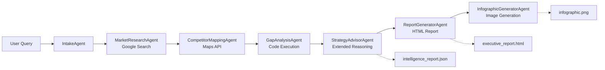

# Retail AI Location Strategy with Google ADK

A multi-agent AI pipeline for retail site selection, built with [Google Agent Development Kit (ADK)](https://google.github.io/adk-docs/) and Gemini 3.

## What It Does

Given a location and business type, this pipeline automatically:

- Researches the market using live web search
- Maps competitors using Google Maps Places API
- Calculates viability scores with Python code execution
- Generates strategic recommendations with extended reasoning
- Produces an HTML executive report and visual infographic

## Quick Start

### Prerequisites

- [Google AI Studio API key](https://aistudio.google.com/app/apikey)
- [Google Maps API key](https://console.cloud.google.com/apis/credentials) (with Places API enabled)

### Setup

**Using [UV](https://docs.astral.sh/uv/) (Recommended)**

```bash
# 1. Clone and enter project
git clone https://github.com/lavinigam-gcp/build-with-adk.git
cd build-with-adk/retail_ai_location_strategy_adk

# 2. Configure API keys
cp .env.example .env
# Edit .env with your GOOGLE_API_KEY and MAPS_API_KEY

# 3. Run (auto-installs dependencies)
uv run adk web
```

<details>
<summary>Alternative: Using pip</summary>

```bash
git clone https://github.com/lavinigam-gcp/build-with-adk.git
cd build-with-adk/retail_ai_location_strategy_adk
python -m venv venv
source venv/bin/activate  # Windows: venv\Scripts\activate
pip install -r requirements.txt
cp .env.example .env
# Edit .env with your keys
cd ..
adk web
```

</details>

Open `http://localhost:8000`, select **retail_ai_location_strategy_adk** from the dropdown, and try one of the examples below.

### Option B: Run with Interactive UI (AG-UI Frontend)

For a richer experience with real-time pipeline visualization:

```bash
# Terminal 1: Start the backend
cd frontend/backend
pip install -r requirements.txt
python main.py
# Runs at http://localhost:8000

# Terminal 2: Start the frontend
cd frontend
npm install --legacy-peer-deps
cp .env.local.example .env.local
npm run dev
# Runs at http://localhost:3000
```

Open `http://localhost:3000` to see the interactive dashboard with collapsible pipeline steps, live progress tracking, and downloadable reports.

See [frontend/README.md](frontend/README.md) for detailed frontend documentation.

### Try These Examples

| Region | Location | Business | Example Prompt |
|--------|----------|----------|----------------|
| Asia | Bangalore, India | Coffee Shop | "I want to open a coffee shop in Indiranagar, Bangalore" |
| Asia | Tokyo, Japan | Ramen Restaurant | "Analyze Shibuya, Tokyo for opening a ramen restaurant" |
| Asia | Singapore | Bubble Tea | "Where should I open a bubble tea shop in Orchard Road, Singapore?" |
| Americas | Austin, Texas | Fitness Studio | "Where should I open a fitness studio in Austin, Texas?" |
| Americas | Mexico City | Taco Restaurant | "Analyze Roma Norte, Mexico City for a taco restaurant" |
| Americas | Toronto, Canada | Craft Brewery | "Help me find a location for a craft brewery in Toronto's Distillery District" |
| Europe | London, UK | Bookstore Cafe | "Help me find the best location for a bookstore cafe in Shoreditch, London" |
| Europe | Berlin, Germany | Vegan Restaurant | "Analyze Berlin's Kreuzberg for opening a vegan restaurant" |
| Middle East | Dubai, UAE | Bakery | "I'm planning to open a bakery in Dubai Marina" |
| Oceania | Sydney, Australia | Juice Bar | "Analyze the market for a juice bar in Bondi Beach, Sydney" |

## Architecture



The pipeline is built as a `SequentialAgent` that orchestrates 7 specialized sub-agents, each handling a specific phase of the analysis.

## Learn More

For detailed documentation, see **[DEVELOPER_GUIDE.md](DEVELOPER_GUIDE.md)**:

- [The Business Problem](DEVELOPER_GUIDE.md#the-business-problem) - Why this exists
- [Architecture Deep Dive](DEVELOPER_GUIDE.md#architecture-deep-dive) - State flow and agent communication
- [Agents and Tools](DEVELOPER_GUIDE.md#agents-and-tools) - Sub-agents, tools, callbacks, schemas
- [Configuration](DEVELOPER_GUIDE.md#configuration) - Model selection and retry options
- [Troubleshooting](DEVELOPER_GUIDE.md#troubleshooting) - Common issues and fixes

## Authors

Based on the original [Retail AI Location Strategy notebook](https://github.com/GoogleCloudPlatform/generative-ai/blob/main/gemini/use-cases/retail/retail_ai_location_strategy_gemini_3.ipynb) by [Lavi Nigam](https://github.com/lavinigam-gcp) and [Deepak Moonat](https://github.com/dmoonat).
